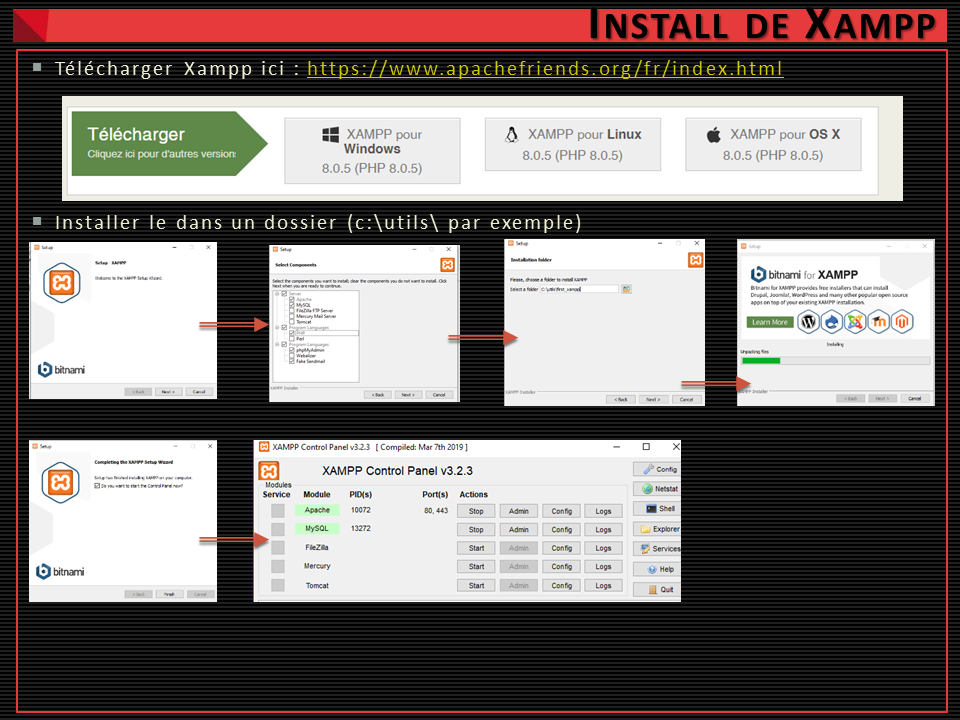
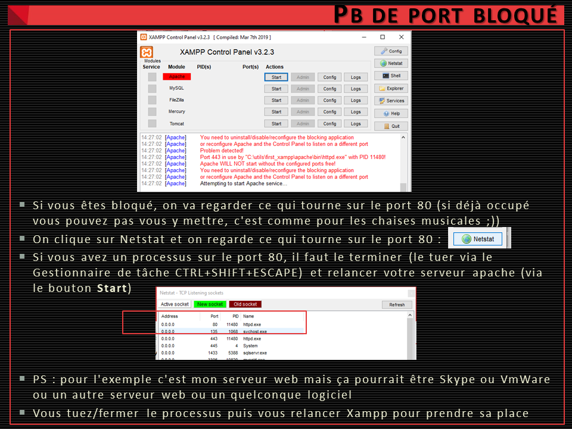
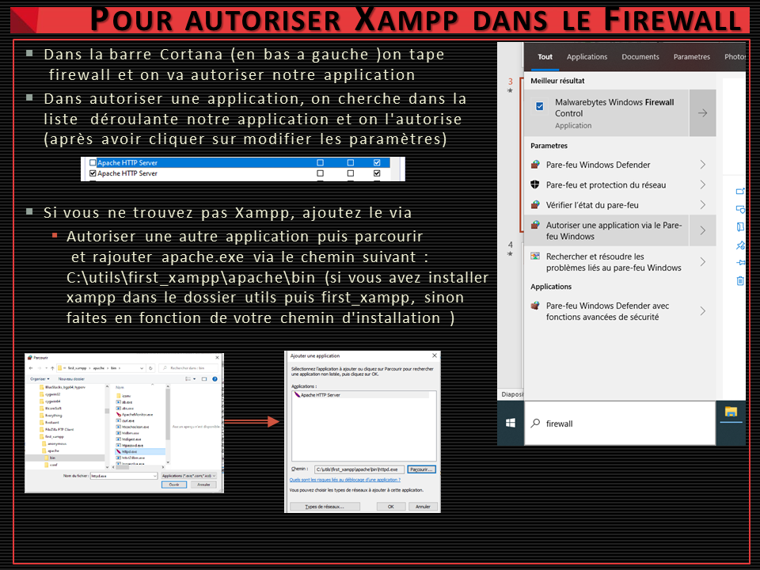
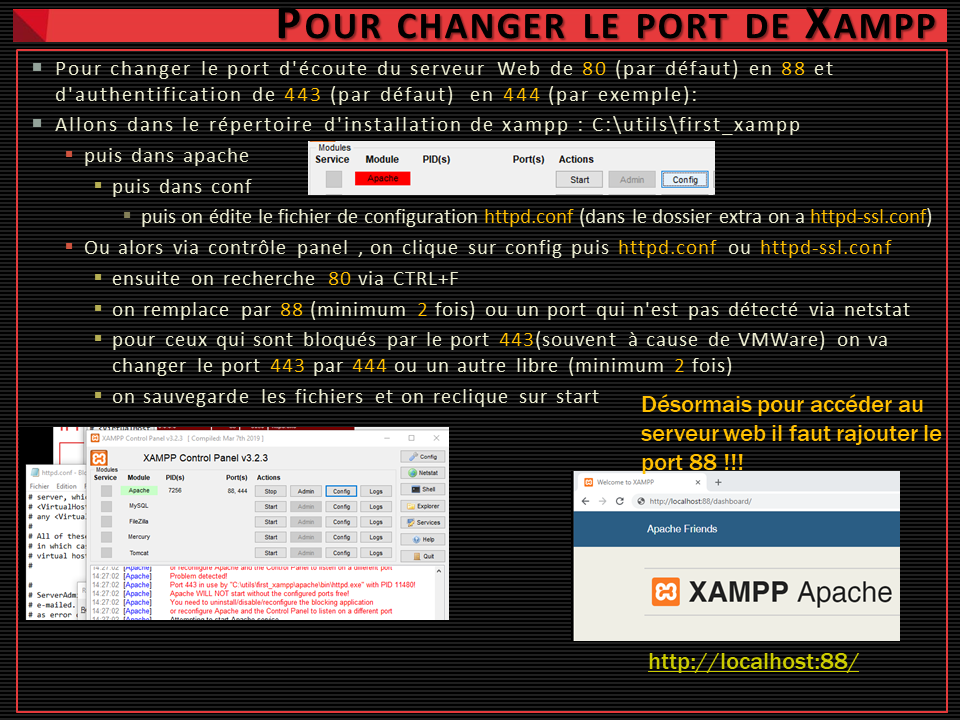
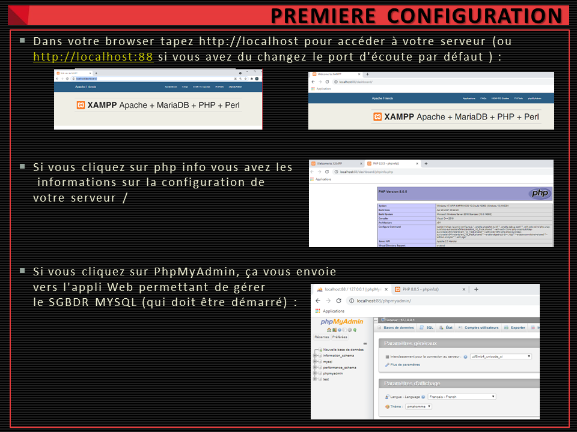
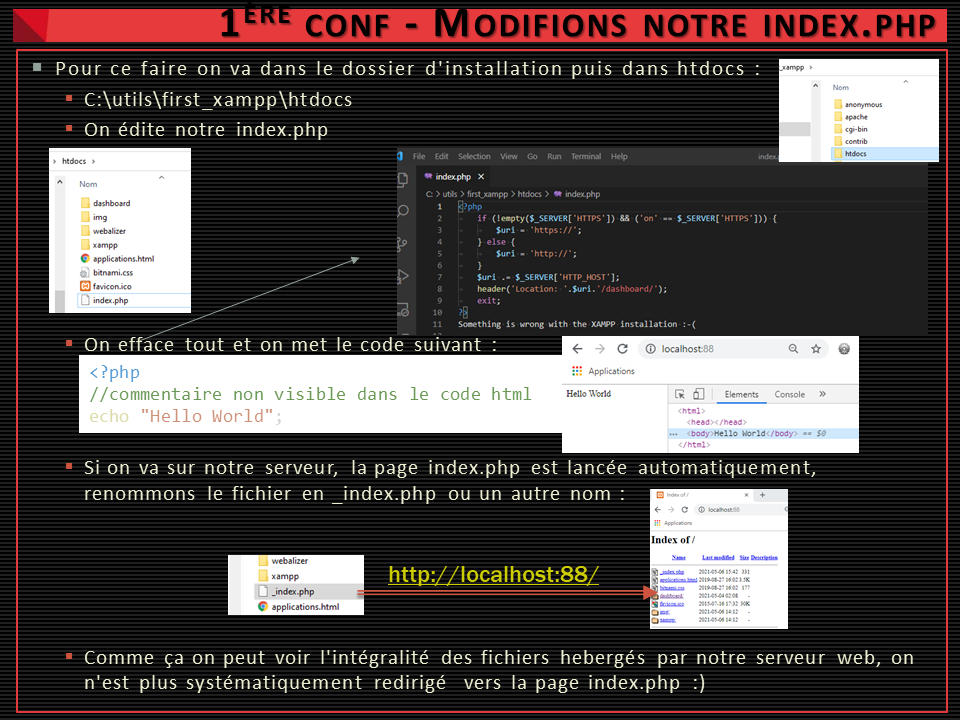
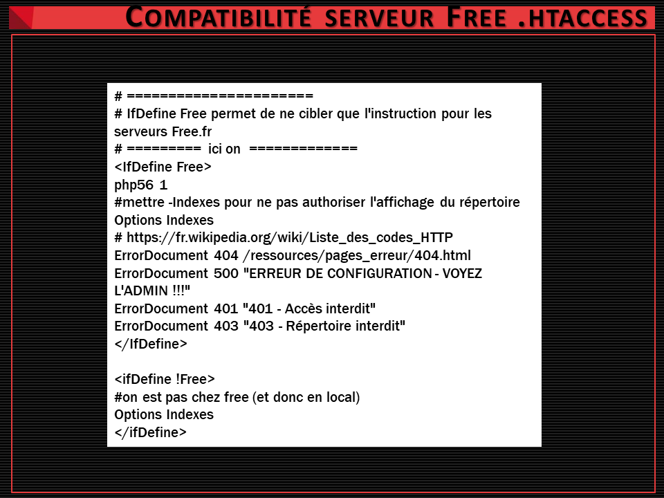

*
:loudspeaker: Bonjour à tous et à toutes :heavy_exclamation_mark:
*
-
---
Vous allez avoir besoin durant les formations d'avoir un serveur web en local afin de tester vos développements AVANT de les publier sur le serveur de Production.  
XAMPP va nous aider à cela.  
Il nous permettra d'avoir une suite logicielle type LAMP hébergeant sur notre ordinateur en local un serveur web complet (Apache (pour l'envoi de fichiers), PhP, Mysql/MariaDb (pour gérer la persistence des données dans une Base de Donnée)).  
Pour nos premiers on installera pas tout mais vous êtes libres de rajouter des modules bitnami ou même d'installer plusieurs versions de Xampp (et donc de Php, il vous faudra juste soit switcher entre les serveurs , soit les lancer sur des ports d'écoute différents) sur votre poste de développement.  

## TODO  :roller_coaster::

<h4> CAS 1 - Installation normale avec la dernière version de Xampp </h4>
Pour ce faire suivez les instructions suivantes : ou suivez les tutoriels en ligne suivants :

- Pour ceux sont sur <i class="fab fa-linux fa-xl"></i> Linux,<i class="fab fa-ubuntu fa-xl"></i> Ubuntu, suivez les instructions de la `communauté` : [->ICI <i class="fas fa-external-link-alt"></i><- ](https://doc.ubuntu-fr.org/xampp)  
- Pour ceux sur Windows : https://fr.wikihow.com/installer-XAMPP-pour-Windows  

<h4> CAS 2 - Installation personnalisée d'une version de XAMPP en php 5.6.28 (pour être au plus proche de la config des serveurs php de Free) </h4>

  - Pour ceux sont sur <i class="fab fa-linux fa-xl"></i> Linux, <i class="fab fa-ubuntu fa-xl"></i> Ubuntu : 
    - `Télécharger` *PUIS* `installer` ***Xampp*** ( <mark>La 5.6.28, pas la derniere !!! </mark>) :[->ICI <i class="fas fa-external-link-alt"></i><-](https://sourceforge.net/projects/xampp/files/XAMPP%20Linux/5.6.28/).
    - Pour vous aider vous avez les instructions de la `communauté` : [->ICI <i class="fas fa-external-link-alt"></i><- ](https://doc.ubuntu-fr.org/xampp)  
  - Pour ceux qui sont sur <i class="fab fa-windows fa-xl"></i> Windows, `Télécharger` *PUIS* `installer` ***Xampp*** ( <mark>La 5.6.28, pas la derniere !!! </mark>) :[->ICI <i class="fas fa-external-link-alt"></i><-](https://sourceforge.net/projects/xampp/files/XAMPP%20Windows/5.6.28/).
  - Suivez les instructions suivantes :  

     <h4> 1.Suivez le déroulé des écrans après avoir téléchargé votre version de Xampp (pas forcément la 8): </h4>

       
     <h4> 2. En cas de problème dans le lancement du serveur Web (toujours regarder les logs ou messages d'erreurs)</h4>  

       
     <h4> 3. Parfois on a un blocage avec notre parefeu : </h4>  
     
       

     <h4> 4. Selon les besoins on doit changer le port d'écoute de notre serveur Web : </h4>  
     
     

     <h4> 5. Pour mettre en conformité avec free ou visualiser les fichiers dans le dossier de travail : </h4>  
     
     

      <h4> 6. Voyons les fichiers situés à la racine du dossier htdocs </h4>  

      

      <h4> 7.Créez un fichier .htaccess à la racine du dossier htdocs</h4>  
     
     
       - [Tuto a récupérer au format PDF ->ICI<- ](Install_Xampp.pdf)
       - fichier [htaccess](htaccess) a renommer en `.`htaccess

  - Pour ceux qui sont sur <i class="fab fa-apple"></i> Mac, `Télécharger` *PUIS* `installer` ***Xampp*** ( <mark>La 5.6.28, pas la derniere !!! </mark>) :[->ICI <i class="fas fa-external-link-alt"></i><-](https://sourceforge.net/projects/xampp/files/XAMPP%20Mac%20OS%20X/5.6.28/).
    - Vous pouvez suivre la doc [->ICI<-](https://www.apachefriends.org/faq_osx.html)

Merci de garder pour vous les ressources que vous y trouverez et de ne pas les diffuser :smirk:  
Merci de m'avertir de toute erreur ou coquille qui m'auraient échapées :heart_eyes:

 :copyright: :no_entry_sign: Do not distribute    :relieved:

 <a href='https://fr.freepik.com/vecteurs/ordinateur'>Ordinateur vecteur créé par freepik - fr.freepik.com</a>