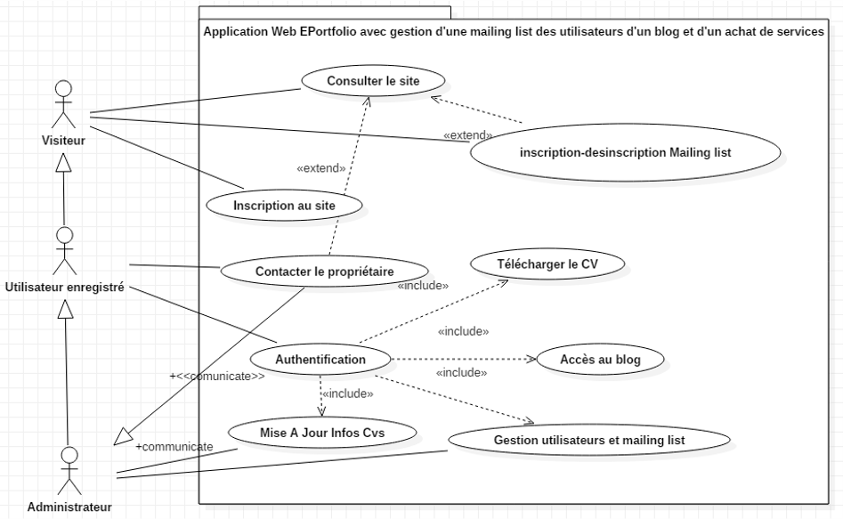
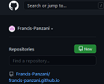
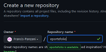
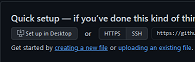
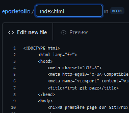
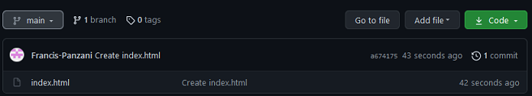
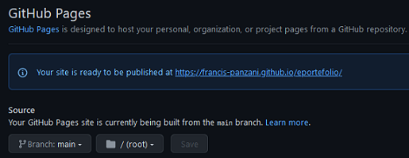
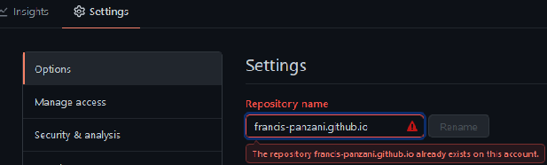

*<center>:loudspeaker: Bonjour à tous et à toutes :heavy_exclamation_mark:</center>*
-
---
<center>  Résumé du cahier des charges d'un E-portfolio : </center>
<i class="fas fa-portrait"></i>
Le contexte :

- Le portfolio est un témoin et un instrument de développement des compétences de l’élève, c’est « une collection des travaux d'un élève qui fait foi de ses compétences en conservant des traces pertinentes de ses réalisations ».
- Il nous servira donc tout au long de la formation de mise en pratique des apprentissages vus en cours et travaillés lors des TD (c’est à l’élève, en autonomie, de le construire au fur et à mesure).
- Il permet à un futur employeur de prendre connaissance du parcours scolaire et professionnel de l’étudiant tout en prenant connaissance des réalisations de l’étudiant (via le site ou via les Screenshots ou liens git/github laissés sur le site).
- Il est un moyen de communication et de diffusion de l’actualité de l’étudiant/stagiaire et de son CV, c’est sa carte de visite digitale.
- Il peut avoir une partie publique et une partie privée.
- Une partie librement personnelle (dont l’accès peut être privé) est à fournir en plus des minimas (mandatory = obligatoire) requis.

Un style épuré (twitter <i class="fab fa-twitter"></i>) vaux mieux qu’un patchwork de styles <a href="https://www.google.com/url?sa=i&url=https%3A%2F%2Fwww.pinterest.fr%2Fpin%2F501447739752585137%2F&psig=AOvVaw2n7E38gqU4wbs-chu5N19y&ust=1622285607252000&source=images&cd=vfe&ved=0CAIQjRxqFwoTCOCCp5ab7PACFQAAAAAdAAAAABAD" title="mais si vous devenez célèbres n'hesitez pas">type Picasso</a>  
<br/>


_Voilà un exemple de diagramme de cas d'utilisation du site hébergeant votre E-Portefolio dont vous pouvez vous inspirer pour votre réalisation :_


Vous pouvez créer votre propre arborescence des pages de votre site en utilisant https://mockflow.com/ : 
> L’arborescence d’un site web permet d’avoir une vision globale du site et des parcours de navigation avant de réaliser les maquettes des pages principales.
>
> -- <cite>[lafabriquedunet](https://www.lafabriquedunet.fr/conseils/conception-site-web/arborescence-site-web/)</cite>
<div style="position:relative;">
<span  style="position:relative;">

Mandatory :
- [x] <i class="fas fa-home"></i> Home
- [x] <i class="fas fa-sign-in-alt"></i> Inscription/Authentification
- [x] <i class="fab fa-creative-commons-by"></i> <i class="fab fa-creative-commons"></i> Mes réalisations
- [x] <i class="fas fa-address-card"></i> Contact/Envoi CV
- [x] <i class="fas fa-envelope"></i> Mailing List / Inscription   Désinscription
- [ ] <i class="fas fa-project-diagram" style="color:blue;"></i> Votre touche perso
- [ ]   <i class="fas fa-project-diagram" style="transform: rotate(-90deg); color:red;"></i> Vos ajouts persos
 </span>
<p class="d-sm-block alert alert-warning text-center" role="alert" style="position:absolute; top:10px; left:350px; width:200px; transform: rotate(-45deg);">
Faire via une One Page ou des pages avec<br/> Gabarit et un footer identique 
<p>
</div>

## TODO  :roller_coaster::
<h4> 1. Commencer a `Brainstormer` afin de définir le périmètre du projet :</h4>

 - Quel est l'objectif du développement (et oui c'est bien de partir sur de bonnes bases)
 - Que rajouter d’original ?
 - Comment rendre joli ou regardable le site ?
 - Comment le mettre en ligne ? 
 - Comment ne pas se faire prendre par le temps et pouvoir le rendre dans les temps ?

<h4>2. On va commencer à chercher un hébergeur (gratuit pour débuter) afin d'y envoyer nos pages Webs : </h4>
<p class="d-sm-block alert alert-primary text-center" role="alert">Rappel : dans un dossier web ce sont les fichiers index.html index.php qui sont propulsés par défaut par le serveur web et donc lus par défaut par nos navigateurs. <br/>Donc créez toujours un fichier racine index.html qui sera le point d'entrée de votre site internet.</p>

 - On va voir avec <i class="fab fa-github"></i> *Github page* (ça tombe bien on est déjà sur le site ) uniquement pour des sites statiques (<i class="fab fa-html5"></i>HTML <i class="fab fa-css3-alt"></i>CSS <i class="fab fa-js-square"></i>Javascript) qui hébergera les pages dans un repository (un dossier).
 
    - Créez-vous un compte sur le site [->Ici<-](https://github.com/) (<cite>Tous les fichiers hébergés sur votre compte GitHub gratuit sont publics, à moins de souscrire à un compte privé payant</cite>)
    - Cliquez sur `(New)` en haut à droite afin de créer un repository <span style="float:right"> `(New)`-></span>
    - Puis `(Créer)` le repo avec un nom que vous choisissez (create a repository)
    - Félicitations votre repo est créé, maintenant on va y ajouter nos pages
    - Cliquez soit sur `(creating a new file)` ou `upload an existing file` afin de rajouter soit du code html soit une page que vous avez déjà faite (un index.html :smile:)
    - ou alors vous pouvez pusher si vous avez suivi la formation Git [->Ici<-](/posts/formations/formation_git/)
    - On va créer un nouveau fichier index.html dont on `(copie colle)`ra le code suivant : <span style="float:right"><br/><br/>  `(creating a new file)` &darr;<br/> `(copie colle)` </span>
      ```html 
          <!DOCTYPE html>
      <html lang="fr">
      <head>
          <meta charset="UTF-8">
          <meta http-equiv="X-UA-Compatible" content="IE=edge">
          <meta name="viewport" content="width=device-width, initial-scale=1.0">
          <title>first git page</title>
      </head>
      <body>
          <h1>Ma première page sur Git</h1>
          <hr>
          Let's Code : 
      </body>
      </html>
      ```
    - [ ] Ou alors on importera le fichier index.html [->Ici<-](index.html) 
    - Puis on clique sur Commit new file et on obtiendra le résultat suivant : 
    
    <span style="float:right"><br/></span>
    - Maintenant affichons le résultat via notre navigateur , pour cela on clique sur &rarr;<i class="fas fa-cog"></i> `Settings` puis &rarr; `Pages` et enfin on va selectionner *main* (qui est notre branche par défaut) puis on clique sur `Save` : 
    - Si vous cliquez sur le lien la page est accessible et visible depuis l'extérieur (parfois avec un peu de latence) https://francis-panzani.github.io/eportefolio/ (pour moi sur cet example)
  
  <br/><br/><br/>
  - Maintenant comment faire pour qu'on accède à votre site directement avec juste le nom de votre compte <i class="fab fa-github"></i> Github comme pour moi : https://francis-panzani.github.io/ ?
    - Il y a une petite astuce, il faut renommer votre repo en mettant exactement le même nom que celui de votre compte<i class="fab fa-github"></i> Github et en y accolant `.github.io`  pour ce faire cliquer sur `Options` tout en haut dans les <i class="fas fa-cog"></i> `Settings`  

     Bon mon nom est déjà pris mais pour vous ça devrait être bon, sinon il faudra en choisir un autre.
  <hr/>

- Il existe d'autres solutions gratuites, à vous de voir : 
  - Vous avez Netlifly qui se link avec votre compte GitHub https://www.netlify.com/ 
  - Vous avez Heroku https://www.heroku.com/ 
  - Et les indéboulonnables pages persos Free depuis plus de 20 ans : https://subscribe.free.fr/accesgratuit/index.html

<p class="d-sm-block alert alert-primary text-center" role="alert"> On utilisera pour la suite des cours les pages persos de<a href="https://subscribe.free.fr/accesgratuit/index.html"></a> (merci à eux) car on peut utiliser gratuitement du <i class="fab fa-php fa-2x" style="color:blue; vertical-align: middle;"></i> (5.6 Max atm) ainsi qu'un espace de stockage conséquent, une bdd Mysql et un logiciel Ftp pour uploader les pages.</p>

## Débuter le TP : 
:mortar_board: [---> Afin de débuter le TP EporteFolio ensemble, vous aurez besoin de suivre les instructions du support suivant :  :books: (Logins  & Passswords :closed_lock_with_key: donnés par le formateur) :pill: <---](http://franpan.free.fr/formation/_portefolio007).

:copyright: :no_entry_sign: Do not distribute    :relieved:
 :copyright: :no_entry_sign: Do not distribute    :relieved: 