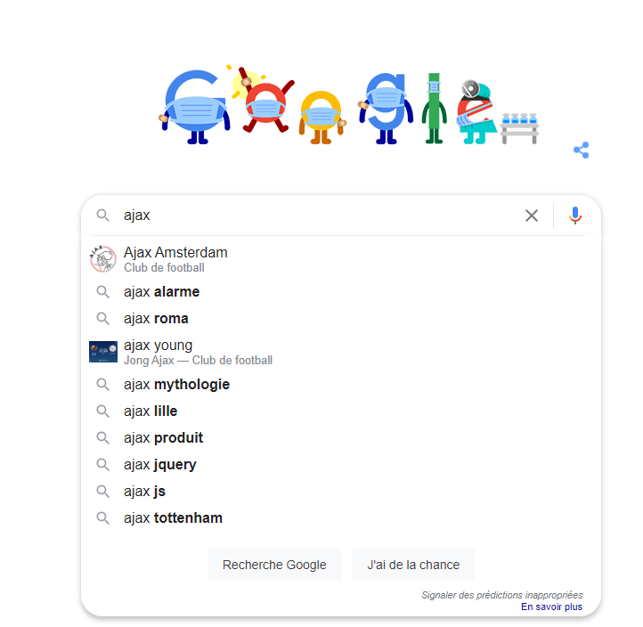

## _
:loudspeaker: Bonjour à tous et à toutes :heavy_exclamation_mark:
_

---

Dans cette courte formation (après une bonne maitrise du tryptique HTML <i class="fab fa-html5"></i> CSS<i class="fab fa-css3-alt"></i> & Javascript<i class="fab fa-js-square"></i>), on verra comment utiliser

<mark style='line-height:70px;'> : Asynchronous JavaScript and XML</mark>

et l'utiliser dans un TP assez pratique pour les formulaires d'inscriptions :smile:.

>  “ AJAX (Asynchronous JavaScript + XML) n'est pas une technologie en soi, mais un terme désignant une « nouvelle » approche utilisant un ensemble de technologies existantes, dont : HTML ou XHTML, les feuilles de styles CSS, JavaScript, le modèle objet de document (DOM), XML, XSLT, et l'objet XMLHttpRequest.  Lorsque ces technologies sont combinées dans le modèle AJAX, les applications Web sont capables de réaliser des mises à jour rapides et incrémentielles de l'interface utilisateur sans devoir recharger la page entière du navigateur. Les applications fonctionnent plus rapidement et sont plus réactives aux actions de l'utilisateur.”
>
> -- <cite>[MDN <i class="fas fa-external-link-alt"></i>](https://developer.mozilla.org/fr/docs/Web/Guide/AJAX)</cite>

Ajax est un incontournable depuis bien des années, on l'utilise au quotidien même sans s'en rendre compte, google maps charge les images avec, affinant le rendu au fur et a mesure, la barre de recherche de google l'utilise des que l'on appuie sur une touche afin de nous délivrer les informations les plus pertinentes possibles (Oui enfin ça dépends des mots clefs utilisés aussi :tongue: (cf recherche de droite))

Paramétrons notre environnement de développement (ça va être rapide :smile:) afin de pouvoir démarrer la formation :

## TODO :roller_coaster::

A ne réaliser que si vous n'avez pas de [L A M P <i class="fas fa-external-link-alt"></i>](https://fr.wikipedia.org/wiki/LAMP) déjà installé sur votre OS.

- `Télécharger` _PUIS_ `installer` Xampp (peu importe la version) :[->ICI<- <i class="fas fa-external-link-alt"></i>](https://www.apachefriends.org/fr/index.html)
- `Télécharger` _PUIS_ `installer` Visual Studio Code :[->ICI<- <i class="fas fa-external-link-alt"></i>](https://code.visualstudio.com/)
- Ou un éditeur type [NPP, NotePad++ <i class="fas fa-external-link-alt"></i>](https://notepad-plus-plus.org/) light fera l'affaire, on ne fera pas de gros débuggage de toute façon)

:mortar_board: [Afin de débuter la Formation sur AJAX ensemble, vous aurez besoin de suivre les instructions du :books:support suivant et/ou de récupérer les éléments de la  apsule : (Logins & Passswords :closed_lock_with_key: donnés par le formateur &nbsp; <i class="fas fa-chalkboard-teacher"></i> &nbsp;)&nbsp; <i class="fas fa-external-link-alt"></i>.](http://franpan.free.fr/formation/_ajax005 "lien vers le site contenant les fichiers de la formation")

Merci de garder pour vous les ressources que vous y trouverez et de ne pas les diffuser :smirk:  
Merci de m'avertir de toute erreur ou coquille qui m'auraient échapées :heart_eyes:

:copyright: :no_entry_sign: Do not distribute :relieved:
