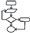

*
:loudspeaker: Bonjour à tous et à toutes :heavy_exclamation_mark:
*
---

 

<i class="fas fa-info-circle " style="color: blue;"></i> Au programme de cette formation Algorithmique : 

  - Configuration environnement de développement
  - Les variables
  - La Structure générale 
  - Les conditions 
  - Les Boucles
  - Les Tableaux
  - Les Chaines de caractères
  - Les Fonctions

> 
>L'algorithmique est l'étude et la production de règles et techniques qui sont impliquées dans la définition et la conception d'algorithmes, c'est-à-dire de processus systématiques de résolution d'un problème permettant de décrire précisément des étapes pour résoudre un problème algorithmique.
>
>Le substantif algorithmique désigne l'ensemble des méthodes permettant de créer des algorithmes. Le terme est également employé comme adjectif.
>
>Un algorithme énonce une solution à un problème sous la forme d’un enchaînement d’opérations à effectuer.
>
>Les informaticiens utilisent fréquemment l’anglicisme implémentation pour désigner la mise en œuvre de l'algorithme dans un langage de programmation. Cette implémentation réalise la transcription des opérations constitutives de l’algorithme et précise la façon dont ces opérations sont invoquées. Cette écriture en langage informatique, est aussi fréquemment désignée par le terme de « codage ».
>On parle de « code source » pour désigner le texte, constituant le programme, réalisant l’algorithme. Le code est plus ou moins détaillé selon le niveau d’abstraction du langage utilisé, de même qu'une recette de cuisine doit être plus ou moins détaillée selon l’expérience du cuisinier.
>
> <cite>[  Wikipedia <i class="fas fa-external-link-alt"></i>](https://fr.wikipedia.org/wiki/Algorithmique "Définition à lire pour bien comprendre")</cite>

Paramétrons notre environnement de développement afin de pouvoir démarrer la formation : 
## TODO  :roller_coaster:: 
- :point_right: ***Venir avec*** `*papier*` et `*crayons*` 

- :point_right: `Télécharger` Python 3.7 :[->ICI <i class="fas fa-external-link-alt"></i><-](https://www.python.org/downloads/release/python-370/), on l'installera ensemble
 

:mortar_board: Afin de débuter la Formation sur **l'Algorithmique** ensemble, vous aurez besoin de suivre les instructions du :books:support et/ou de récupérer les éléments de la  apsule donnés par le formateur &nbsp; <i class="fas fa-chalkboard-teacher"></i> &nbsp; le jour de la formation :exclamation:

Merci de garder pour vous les ressources que vous y trouverez et de ne pas les diffuser :smirk:  
Merci de m'avertir de toute erreur ou coquille qui m'auraient échapées :heart_eyes:

:copyright: :no_entry_sign: Do not distribute    :relieved: