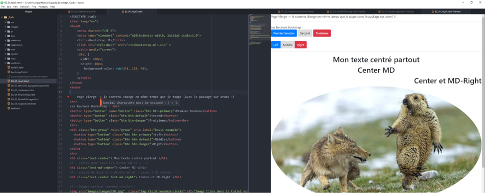

## _<center>:loudspeaker: Bonjour à tous et à toutes :heavy_exclamation_mark:</center>_

---

Dans cette formation on verra comment installer et utiliser <mark> Bootstrap V4</mark>, faire du responsive Web Design, utiliser ses éléments typographiques, l'utiliser pour nous aider à faire la mise en page de nos sites internets et utiliser les éléments avancés (carroussel et autres) qu'apportent ce framrwork front gratuit (encore merci à tous ceux qui contribuent ou qui ont contribués à ce très beau projet).
Ce sera une formation essentiellement pratique avec pas mal d'exercices, de TP /TD et on aura des résultats assez rapidement.

[ ](https://getbootstrap.com/)  
<span style="text-align: justify; clear:both">
_Passons en revue ses caractéristiques_ :</span>

- [x] Bootstrap est le framework HTML <i class="fab fa-html5"></i> CSS<i class="fab fa-css3-alt"></i> & Javascript<i class="fab fa-js-square"></i> le plus populaire au monde actuellement pour la création de pages web interactives et responsives.
- [x] Il est entièrement gratuit. Des millions de sites sur le Web sont réalisés avec Bootstrap.
- [x] Il y a énormément de thèmes et de templates gratuits à utiliser.
- [x] Bootstrap est Mobile First, Responsive et utilise un système de Grille.
- [x] Il utilise Reboot afin d’avoir un thème unique pour chaque navigateur.
- [x] Bootstrap c’est un ensemble de fichiers (HTML <i class="fab fa-html5"></i> CSS<i class="fab fa-css3-alt"></i> & Javascript<i class="fab fa-js-square"></i>) qui va servir de bases pour la création de pages web.

En gros c'est un ensemble de fichiers que l'on va utiliser pour nous simplifier la vie et rendre tout joli nos sites quelque soit le 'device' que l'on utilise pour visualiser les pages que l'on a créées (Smartphones, Tablettes ou Pcs).

---

## TODO :roller_coaster::

-  En premier on télécharge le framework [->ici<-](https://getbootstrap.com/docs/4.0/getting-started/download/) et on le dézippe dans un dossier de travail (idéalement dans un dossier du répertoire de publication de votre serveur web mais c'est pas obligé)
- Installez un éditeur de code typé front, ici on utilisera Atom [->ICI<-](https://atom.io/)
   (On cliquera sur download puis next\* quand même)
- Installer le plugin pour atom : atom-html-preview ici : https://atom.io/packages/atom-html-preview
  - Là c'est plus dur :
    - Soit on clique sur le bouton install en vert en haut
    - Soit on fait <KBD>CTRL+SHIFT+H</KBD> dans l'éditeur et on cherche atom-html-preview puis on l'installe
    - Soit on tappe la ligne de commande suivante :
    ```shell
    apm install atom-html-preview
    ```
  - Puis on tappe du code et avec le preview on voit directement les modifications (CTRL SHIFT H ou clic droit dans la page de code et PREVIEW HTML)
  - Avec un peu de temps vous arriverez a ce type de résultat (vous inquiétez si vous n'y arrivez pas tout de suite, on le refera en cours) :
    

<div class="d-sm-block  alert alert-success  text-left" role="alert">

:mortar_board: [Afin de débuter la Formation sur Bootstrap ensemble, vous aurez besoin de suivre les instructions du :books:support suivant et/ou de récupérer les éléments de la <span style='display:FLEX;margin:0'> apsule : (Logins & Passswords :closed_lock_with_key: donnés par le formateur &nbsp; <i class="fas fa-chalkboard-teacher"></i> &nbsp;)&nbsp; <i class="fas fa-external-link-alt"></i>.</span>](http://franpan.free.fr/formation/_bootstrap421 "lien vers le site contenant les fichiers de la formation")

</div>

Pour aller plus loin vous pouvez consulter ces sites qui sont très bien fait et vous apporteront des éléments et des compétences non négligeables dans votre utilisation du framework :

- L'officiel : https://getbootstrap.com/docs/4.0/getting-started/introduction/
- Un très bon tutoriel (le site est très intéressant, parcourez-le ) : https://laravel.sillo.org/bootstrap-4/

Merci de garder pour vous les ressources que vous y trouverez et de ne pas les diffuser :smirk:  
Merci de m'avertir de toute erreur ou coquille qui m'auraient échapées :heart_eyes:

:copyright: :no_entry_sign: Do not distribute :relieved:
