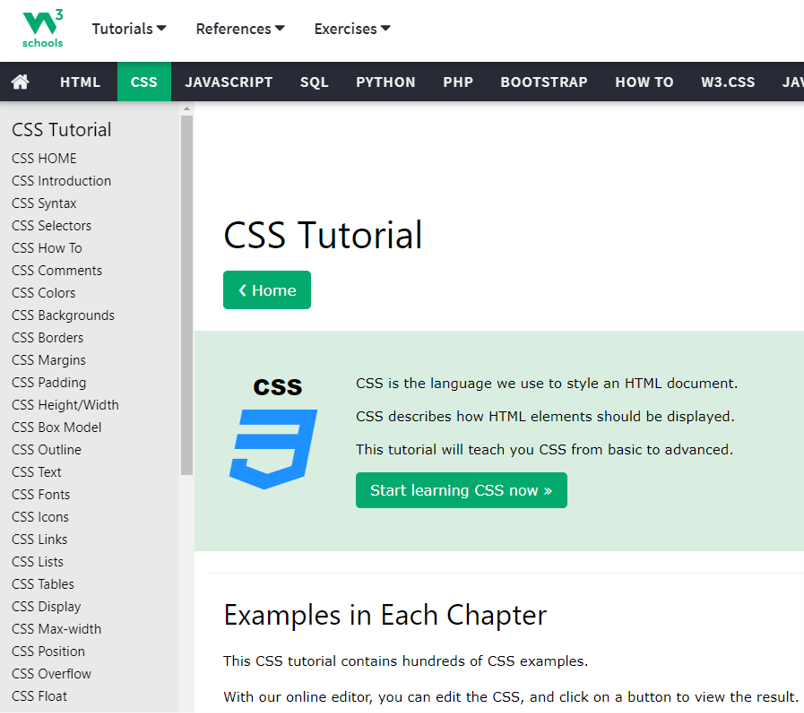
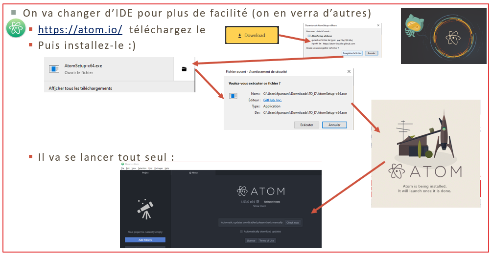
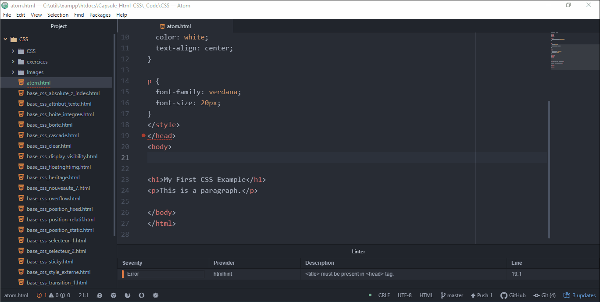

*<center>:loudspeaker: Bonjour à tous et à toutes :heavy_exclamation_mark:</center>*
-

<div class="d-sm-block  alert alert-info text-center" role="alert"> 
<i class="fas fa-info-circle " style="color: blue;"></i> Nous verrons dans cette formation sur <mark> CSS  (Feuilles de style en cascade) </mark> , les fondamentaux, l’essentiel pour démarrer avec ce langage qui est présent quasiment depuis le début du WWWeb et est un incontournable de la création de <i class="fas fa-sitemap"></i>sites internet, <i class="fas fa-file-code"></i>pages web ou même support de documentation <br/>
</div>

>  “ Les feuilles de style en cascade, généralement appelées CSS de l'anglais Cascading Style Sheets, forment un langage informatique qui décrit la présentation des documents HTML et XML.  
> Les standards définissant CSS sont publiés par le World Wide Web Consortium (W3C).  
Introduit au milieu des années 1990, CSS devient couramment utilisé dans la conception de sites web et bien pris en charge par les navigateurs web dans les années 2000.  
>L'apparition de CSS répond à une volonté de « proposer une alternative à l'évolution du HTML d'un langage de structuration vers un <strong><i>langage de présentation</i></strong> »  ”
>
> <cite>[  Wikipedia <i class="fas fa-external-link-alt"></i>](https://fr.wikipedia.org/wiki/Feuilles_de_style_en_cascade "Définition à lire pour bien comprendre")</cite>
><hr/>
> 
> “ CSS est l'un des langages principaux du Web ouvert et a été standardisé par le [W3C](https://www.w3.org/Style/CSS/#specs).  
Ce standard évolue sous forme de niveaux (levels), CSS1 est désormais considéré comme obsolète, CSS2.1 correspond à la recommandation et CSS3, qui est découpé en modules plus petits, est en voie de standardisation.  ”
>- :point_right: [Outils de développement Firefox <i class="fas fa-external-link-alt"></i>](https://developer.mozilla.org/fr/docs/Tools) <kbd>CTRL+SHIFT+I</kbd> ou <kbd>F12</kbd>  
>- :two_hearts: [L'extension Web Developer <i class="fas fa-cog"></i> <i class="fas fa-external-link-alt"></i>](https://addons.mozilla.org/en-US/firefox/addon/web-developer/), A installer  
>- :raised_hands: [Le livre de recettes de disposition CSS <i class="fas fa-external-link-alt"></i>](https://developer.mozilla.org/fr/docs/Web/CSS/Layout_cookbook)  
>
> <cite>[MDN <i class="fas fa-external-link-alt"></i>](https://developer.mozilla.org/fr/docs/Web/CSS "Définition à lire pour bien comprendre")</cite>

Vous l'avez compris, CSS va nous permettre de positionner, disposer, définir le style (couleur etc ) de nos documents web alors qu'HTML nous permet de structurer et de stoquer les données à afficher.  
Css permet bien plus encore, notamment les animations (que l'on abordera selon les formations).  
De plus le net fourmille de tutos sur CSS  (auxquels vous pouvez bien évidemment aller jeter un oeil ) :

 

<span style="margin-top:5px;"> &nbsp;</span>

1. &nbsp;L'incontournable W3School (Vous le connaissez déjà et on y retournera) : https://www.w3schools.com/css/

2. &nbsp;La bible : https://developer.mozilla.org/fr/docs/Learn/Getting_started_with_the_web/CSS_basics  

3.  &nbsp;  En mode pris par la main : https://docs.microsoft.com/fr-fr/microsoft-edge/devtools-guide-chromium/css/ 

4.  &nbsp; Très intéressant : https://www.alsacreations.com/tuto/liste/2-css.html


<div class="d-sm-block  alert alert-dark text-left" role="alert" style="clear:both;">

Paramétrons notre [environnement de développement (IDE) <i class="fas fa-external-link-alt"></i>](https://fr.wikipedia.org/wiki/Environnement_de_d%C3%A9veloppement) afin de gagner du temps le premier jour de la formation :  

</div>  

## <i class="fas fa-clipboard-list "></i> TODO :roller_coaster::

Dans un premier temps on va changer d'IDE pour passer sur  Atom qui est très orienté Dev Front :

1. [ https://atom.io/ ](https://atom.io/  "1. Cliquez pour télécharger le logiciel atom :)")

2. [](https://www.w3schools.com/css/ "2. Cliquez pour récupérer le code  :)")  
Chez [W3School  <i class="fas fa-external-link-alt"></i>](https://www.w3schools.com/css/) prenez le premier exemple en cliquant sur le bouton vert : <button type="button" class="btn btn-success"> Try it Yourself >></button>  
Le fichier `atom.html` est disponible ici [->ICI<-](atom.html) en cas de <i class="fas fa-briefcase-medical"></i>  

3. 

4. [https://atom.io/packages/atom-html-preview  <i class="fas fa-external-link-alt"></i>  ](https://atom.io/packages/atom-html-preview  "4. Installez ce package topissime mais malheureusement pas assez maintenu " )

5.  

6. 
7.   


Atom a beaucoup d'autre plugins pour vous simplifer la vie : 

- https://atom.io/packages/open-in-browser 
- https://atom.io/packages/open-in-browsers  
 

- https://atom.io/packages/atom-beautify  
- https://atom.io/packages/color-picker 
- https://atom.io/packages/file-icons 

- Emmet est très très très très (non je ne radote pas encore, quoi que :wink: ...) largement utilisé et pas que pour atom :
  - https://emmet.io/
  - https://docs.emmet.io/cheat-sheet/       
  - On tappe ça :  

  ```shell
  #page>div.logo+ul#navigation>li*5>a{Item $}
  ```

  - Puis on fait <kbd>TAB</kbd> (à la fin de la ligne sinon ça ne marche pas)  
  et on obtient ça :  

  ```html
  <div id="page">
    <div class="logo"></div>
    <ul id="navigation">
        <li><a href="">Item 1</a></li>
        <li><a href="">Item 2</a></li>
        <li><a href="">Item 3</a></li>
        <li><a href="">Item 4</a></li>
        <li><a href="">Item 5</a></li>
    </ul>
  </div>
  ```

<div class="d-sm-block  alert alert-success  text-left" role="alert">
Vous avez pu tout faire c'est super :+1: :muscle: , sinon redonnez-vous une chance, au pire on verra ça rapidement le premier jour.  

:speech_balloon: Maintenant que l'on a configurer notre environnement de développement et que l'on a un premier fichier pour démarrer, on peut passer à la formation :astronaut: :  

:mortar_board: [Afin de débuter la Formation sur CSS ensemble, vous aurez besoin de suivre les instructions du :books:support suivant et/ou de récupérer les éléments de la apsule : (Logins & Passswords :closed_lock_with_key: donnés par le formateur <i class="fas fa-chalkboard-teacher"></i> ) <i class="fas fa-external-link-alt"></i>.](http://franpan.free.fr/formation/_css002 "lien vers le site contenant les fichiers de la formation")

</div>

Merci de garder pour vous les ressources que vous y trouverez et de ne pas les diffuser :smirk:  
Merci de m'avertir de toute erreur ou coquille qui m'auraient échapées :heart_eyes:

:copyright: :no_entry_sign: Do not distribute :relieved: