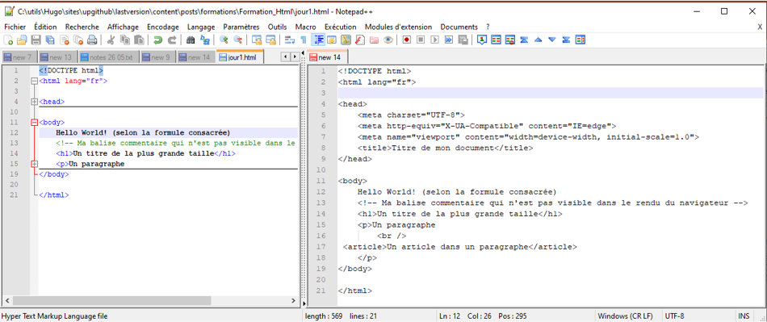
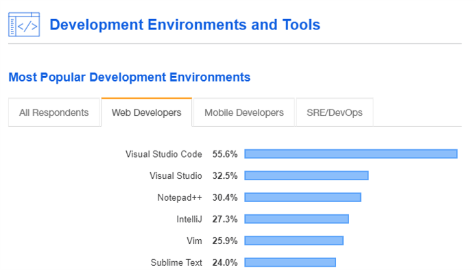

## _<center>:loudspeaker: Bonjour à tous et à toutes :heavy_exclamation_mark:</center>_

---

<div class="d-sm-block  alert alert-info text-center" role="alert"> 
<i class="fas fa-info-circle " style="color: orange;"></i> Nous verrons dans cette formation sur <mark> HTML dans sa version 5 de 2014</mark> , les fondamentaux, l’essentiel pour démarrer avec ce langage de <i class="fas fa-code"></i><b>&lt;balisage&gt;</b> qui est un incontournable lors de la création de <i class="fas fa-sitemap"></i>sites internet, <i class="fas fa-file-code"></i>pages web ou même support de documentation <br/>

</div>

>  “HTML5 (HyperText Markup Language 5) est la dernière révision majeure du HTML (format de données conçu pour représenter les pages web).  
> Cette version a été finalisée le 28 octobre 2014.  
> HTML5 spécifie deux syntaxes d'un modèle abstrait défini en termes de DOM : <b>HTML5</b> (.html et .html) et <b>XHTML5</b> (.xhtml, .xht, .xml).
>
> Le langage comprend également :
>
> - une couche application avec de nombreuses [API <i class="fas fa-external-link-alt"></i>](https://fr.wikipedia.org/wiki/HTML5#API)
> - un algorithme afin de pouvoir traiter les documents à la syntaxe non conforme.”
>
>Ce langage permet :
>
>- d’écrire de l’hypertexte, d’où son nom,
>- de structurer sémantiquement la page,
>- de mettre en forme le contenu,
>- de créer des formulaires de saisie,
>- d’inclure des ressources multimédias dont des images, des vidéos, et des programmes informatiques,
>- de créer des documents interopérables avec des équipements très variés de manière conforme aux exigences de l’accessibilité du web.
>
> -- <cite>[Wikipedia <i class="fas fa-external-link-alt"></i>](https://fr.wikipedia.org/wiki/HTML5 "Définition à lire pour bien comprendre")</cite>

Il nous sert essentiellement à structurer nos pages et gérer/définir le contenu, on fera appel à d'autres technologies CSS   (pour la mise en forme) ou Javascript   pour l'aspect dynamique à l'intérieur d'un même fichier/document `.html`.  
On verra ultérieurement de façon plus approfondie CSS et Javascript (chaque technologie aura droit à son temps de formation).

<div class="d-sm-block  alert alert-dark text-left" role="alert"> 
Paramétrons notre environnement de développement afin de gagner du temps le premier jour :
</div>

## <i class="fas fa-clipboard-list "></i> TODO :roller_coaster::

Dans un premier temps on va apprendre très simplement le framework et on aura besoin uniquement du lien CDN ou du fichier vue.js:

1. `Téléchargez` puis `Installer` le Logiciel   ici : https://notepad-plus-plus.org/downloads/v7.9.1/

   1.1 Puis créer un fichier <mark>Jour1.html</mark>, ensuite insérez puis sauvegardez <kbd>CTRL + S</kbd> le code suivant :

```html
<!DOCTYPE html>
<html lang="fr">

<head>
    <meta charset="UTF-8">
    <meta http-equiv="X-UA-Compatible" content="IE=edge">
    <meta name="viewport" content="width=device-width, initial-scale=1.0">
    <title>Titre de mon document</title>
</head>

<body>
    Hello World! (selon la formule consacrée)
    <!-- Ma balise commentaire qui n'est pas visible dans le rendu du navigateur -->
    <h1>Un titre de la plus grande taille</h1>
    <button>mon bouton</button>
    <input type="file">
    <p style="background-color:red">Un paragraphe
        <br />
     <article>Un article dans un paragraphe</article>
    </p>
</body>

</html>
```

Le fichier `Jour1.html` est disponible ici [->ICI<-](jour1.html) en cas de <i class="fas fa-briefcase-medical"></i>


  
Vous l'avez compris la bonne façon de faire est à gauche :tongue:  
Le logiciel permet de cloner le fichier ouvert ou d'avoir 2 vues (avec de nombreux onglets), il est [très très utilisé <i class="fas fa-external-link-alt"></i>](https://insights.stackoverflow.com/survey/2019#development-environments-and-tools) et est ultra léger, on va démarrer par celui-ci puis en voir d'autres tout au long de votre formation selon les besoins.  
<div class="d-sm-inline-flex  alert alert-danger" role="alert">
<i class="fas fa-exclamation-circle"></i> Attention il a un cache interne, ce qui fait qu'on est pas obligé de sauvegarder tout le temps pour que les données visibles soient écrites dans le fichier (disquette bleu), quand la disquette est en rouge, les données dans le fichiers ne sont pas encore écrites, ce qui peut occasionner des décallages, notamment dans l'interprétation du fichier via un navigateur. 

</div>

  
  1.2  
  Ceci fait ouvrez le depuis votre navigateur en mode local / client, on double clique dessus et on interprète les instructions de code que l'on a rentrées via l'un des choix suivants :

- <i class="fab fa-firefox"></i> Firefox (Maintenu par la fondation Mozilla et qui [aide le plus et de loin la communauté des développeurs <i class="fas fa-external-link-alt"></i>](https://developer.mozilla.org/fr/docs/Web/HTML) )
- <i class="fab fa-chrome"></i> Chrome ([le dominant <i class="fas fa-external-link-alt"></i>](https://fr.wikipedia.org/wiki/Parts_de_march%C3%A9_des_navigateurs_web) )
- <i class="fab fa-safari"></i> Safari (pour ceux qui sont sur Mac)  
- <i class="fab fa-internet-explorer"></i> IE ([le retraité et imposé navigateurde chez crocsoft <i class="fas fa-external-link-alt"></i>](https://www.lexpress.fr/actualite/monde/pourquoi-microsoft-debranche-enfin-son-celebre-navigateur-internet-explorer_2151348.html) )
- <i class="fab fa-edge"></i> Edge ([basé sur Chromium (toute ressemblance avec Chrome n'est pas fortuite) <i class="fas fa-external-link-alt"></i>](https://support.microsoft.com/fr-fr/microsoft-edge/t%C3%A9l%C3%A9charger-le-nouveau-microsoft-edge-bas%C3%A9-sur-chromium-0f4a3dd7-55df-60f5-739f-00010dba52cf))  

- <i class="fab fa-opera"></i> Opera  (un alternatif qui peine à percer mais [propose des innovations intéressantes <i class="fas fa-external-link-alt"></i>](https://www.opera.com/fr) )
- Si vous visualisez le fichier dans plusieurs `familles différentes` de navigateurs (FF, Chrom*, Safari ) vous allez vous rendre compte qu'un même code ne produit pas forcément le même résultat (rendu).  
Et ça l'est encore moins selon les versions des navigateurs ou des devices (<i class="fas fa-desktop"></i> écrans pc, <i class="fas fa-mobile-alt"></i> smartphone, <i class="fas fa-tablet-alt"></i> tablette) qui visualisent vos pages.

Le CSS nous aidera beaucoup à changer le rendu de nos pages, on va le commencer quasiment en parallèle de la formation HTML  tellement ils sont imbriqués et vont de pair.  

   1.3  
   Pour finir on installera sur notre ordinateur un logiciel `ftp` afin d'envoyer des fichiers sur un serveur distant.  
   Vous installerez l'un des 2 logiciels suivants (de préférence filezilla(version cliente, pas le serveur ftp :smile:))  
   - Filezilla (gratuit, massivement utilisé ) ici : https://filezilla-project.org/download.php?type=client
   - WinSCP (une autre solution gratuite qui passe mieux sur certains ftp) ici : https://winscp.net/eng/download.php 

<div class="d-sm-block  alert alert-success  text-left" role="alert">
Vous avez pu tout faire, c'est super :+1: :muscle: , sinon redonnez-vous une chance, au pire on verra ça rapidement le premier jour.  

:speech_balloon: Maintenant que l'on a configurer notre environnement de développement et que l'on a un premier fichier pour démarrer, on peut passer à la formation :astronaut: :  

:mortar_board: [Afin de débuter la Formation sur HTML ensemble, vous aurez besoin de suivre les instructions du :books:support suivant et/ou de récupérer les éléments de la apsule : (Logins & Passswords :closed_lock_with_key: donnés par le formateur <i class="fas fa-chalkboard-teacher"></i> ) <i class="fas fa-external-link-alt"></i>.](http://franpan.free.fr/formation/_html001 "lien vers le site contenant les fichiers de la formation")

</div>

 -  Pour en savoir plus sur NPP : https://www.fabricecourt.com/formation/notepad-trucs-et-astuces/

 - Vous pourrez récupérer des cheatsheets pour vous aider à vous rappeler des <i class="fas fa-code"></i>balises les plus importantes comme celle-ci dans le lien que je vous communique plus bas.  
Et non ce n'est pas de la triche, et oui il n'est pas nécessaire de toutes les connaitre par coeur, rassurez-vous :smile:

SRC : https://www.inmotionhosting.com/blog/html5-cheat-sheets/

Merci de garder pour vous les ressources que vous y trouverez et de ne pas les diffuser :smirk:  
Merci de m'avertir de toute erreur ou coquille qui m'auraient échapées :heart_eyes:

:copyright: :no_entry_sign: Do not distribute :relieved:
