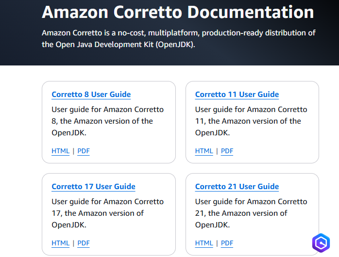
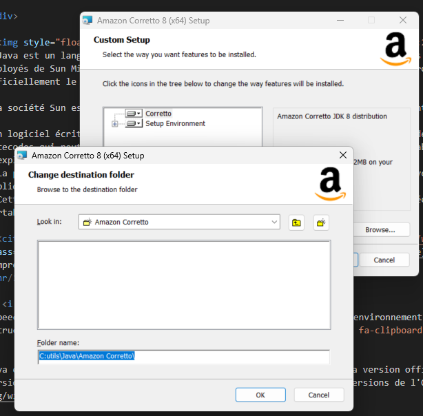
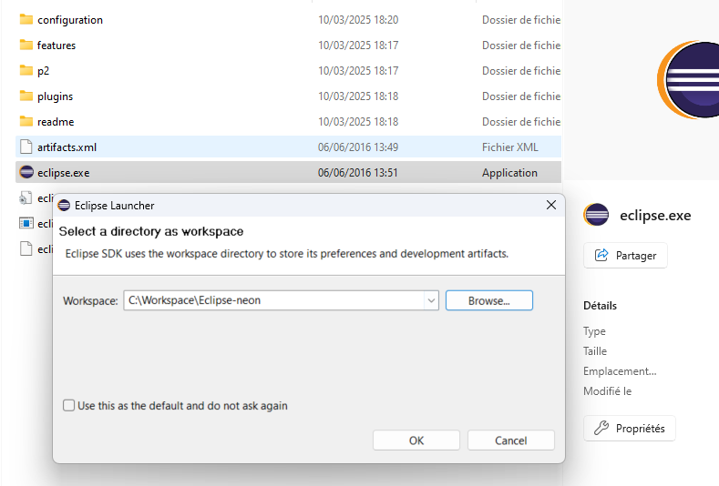

## _
:loudspeaker: Bonjour à tous et à toutes :heavy_exclamation_mark:
_

---

 

<i class="fas fa-info-circle " style="color: blue;"></i> Au programme de cette formation <i class="fa-brands fa-java fa-2xl"></i> Java : 

- 01 - Introduction sur Java premier langage
- 02 - Structures de contrôle
- 03 - Tableaux statiques
- 04 - Chaine de caracteres tableaux dynamiques
- 05 - les méthodes
- 06 - Introduction poo
- 07 - Les constructeurs
- 08 - Héritage et polymorphisme
- 09 - Interface

>  
> Java est un langage de programmation de haut niveau orienté objet créé par James Gosling et Patrick Naughton, employés de Sun Microsystems, avec le soutien de Bill Joy (cofondateur de Sun Microsystems en 1982), présenté officiellement le 23 mai 1995 au SunWorld.
>
>La société Sun est rachetée en 2009 par la société Oracle qui détient et maintient désormais Java.
>
>Un logiciel écrit en langage Java a pour particularité d'être compilé vers un code intermédiaire formé de bytecodes qui peut être exécuté dans une machine virtuelle Java (JVM) en faisant abstraction du système d'exploitation.
> La portabilité du bytecode Java est assurée par la machine virtuelle Java, et éventuellement par des bibliothèques standard incluses dans un JRE.
> Cette machine virtuelle peut interpréter le bytecode ou la compilation à la volée en langage machine. La portabilité est dépendante de la qualité de portage des JVM sur chaque OS.
>
> <cite>[  Wikipedia <i class="fas fa-external-link-alt"></i>](https://fr.wikipedia.org/wiki/Java_(langage) "Définition à lire pour bien comprendre")</cite>
>
 

## <i class="fas fa-clipboard-list "></i> TODO :roller_coaster::
:speech_balloon: Vous devez avoir obligatoirement configuré votre environnement de développement avec les intructions (partie TODO :roller_coaster:) suivantes <i class="fas fa-clipboard-list "></i> :  

Java est tellement populaire qu'il y a des versions concurrentes de la version officielle et surtout des versions entièrement gratuite ce qui ne fut pas toujours le cas des versions de l'OPEN JDK https://fr.wikipedia.org/wiki/OpenJDK.

Afin de vous sensibiliser à l'écosystème du logiciel libre et des différentes versions possibles on utilisera différentes versions du **Java Development Kit (JDK)** qui nous permettrons de développper en <i class="fa-brands fa-java fa-2xl"></i>Java.

- :point_right:  Allez sur [->https://docs.aws.amazon.com/corretto/<-](https://docs.aws.amazon.com/corretto/)

- :point_right: Puis cliquez sur **Corretto 8 User Guide** puis  **_Downloads_**  (:exclamation: attention il y a plusieurs versions, prenez bien celle de votre OS et surtout la version 8:)

- :point_right: Puis suivez le guide jusqu'à la **partie 3)** comprise (pas besoin de faire le point 4 et 5) :sunglasses: https://docs.aws.amazon.com/corretto/latest/corretto-8-ug/windows-install.html 

- :point_right: Installez-le dans un dossier spécifique car vous installerez différentes versions ultérieurement et vous aurez besoin de le linker avec votre IDE (Éditeur pour développer).

- :point_right:  Allez sur  [-> https://archive.eclipse.org/eclipse/downloads/drops4/R-4.6-201606061100/ <-](https://archive.eclipse.org/eclipse/downloads/drops4/R-4.6-201606061100/)
Télécharger la version d'**Eclipse SDK** pour votre **OS** puis dezipper la

Au lancement d'Eclipse Neon vous devez spécifier un repertoire de travail, nommez le comme suit : (on utilisera plusieurs IDE et les repertoires de travail ne sont pas compatibles entre eux alors faites attention:exclamation::exclamation::exclamation:)

Eclipse sera votre IDE pour développer en java, là encore il y a une multitude de versions, nous choisirons celle-ci qui est compatible avec le JDK et qui ne consomme pas trop en mémoire.

:mortar_board: Afin de débuter la Formation sur **<i class="fa-brands fa-java fa-2xl"></i>Java Lvl1** ensemble, vous aurez besoin de suivre les instructions du :books:support et/ou de récupérer les éléments de la  apsule donnés par le formateur &nbsp; <i class="fas fa-chalkboard-teacher"></i> &nbsp; le jour de la formation :exclamation:

Merci de garder pour vous les ressources qui vous serons fournies et de ne pas les diffuser :smirk:  
Merci de m'avertir de toute erreur ou coquille qui m'auraient échapées :heart_eyes:

:copyright: :no_entry_sign: Do not distribute :relieved: