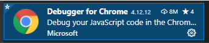
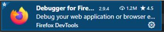
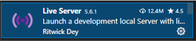
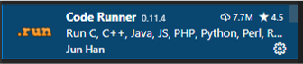
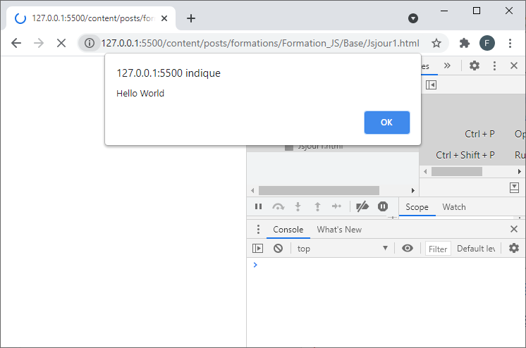
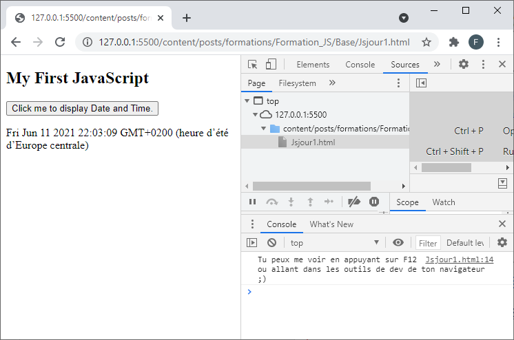

## _<center>:loudspeaker: Bonjour à tous et à toutes :heavy_exclamation_mark:</center>_

---

<div class="d-sm-block alert alert-info text-center" > 
<i class="fas fa-info-circle " style="color: orange;"></i> Nous verrons dans cette formation sur <mark> JavaScript </mark> , les fondamentaux, l’essentiel pour démarrer avec ce langage utilisé pour les <i class="fas fa-sitemap"></i> sites internet, <i class="fas fa-file-code"></i> pages web<br/> ,<i class="fas fa-desktop"></i> logiciels ou même <i class="fas fa-mobile-alt"></i> applications smartphones (oui oui, on peut en trouver de partout :smile:).<br/> 
C'est la troisième couche des technologies standards du web, après HTML et CSS.
</div>

> “JavaScript est un langage de programmation de scripts principalement employé dans les pages web interactives et à ce titre est une partie essentielle des applications web.  
> Avec les technologies HTML et CSS, JavaScript est parfois considéré comme l'une des technologies cœur du World Wide Web.  
> Une grande majorité des sites web l'utilisent, et <strong><i>la majorité des navigateurs web disposent d'un moteur JavaScript dédié </strong></i>pour l'interpréter, indépendamment des considérations de sécurité qui peuvent se poser le cas échéant.  
> C'est un langage <strong><i>orienté objet à prototype</i></strong> : les bases du langage et ses principales interfaces sont fournies par des objets.  
> Cependant, à la différence d'un langage orienté objets, les objets de base ne sont pas des instances de classes. ”
>
> <cite>[  Wikipedia <i class="fas fa-external-link-alt"></i>](https://fr.wikipedia.org/wiki/JavaScript "Définition à lire pour bien comprendre")</cite>
>
> <hr/>
>
>  “ JavaScript (souvent abrégé en « JS ») est un langage de script léger, orienté objet, principalement connu comme le langage de script des pages web.  
> Mais il est aussi utilisé dans de nombreux environnements extérieurs aux navigateurs web tels que Node.js, Apache CouchDB voire Adobe Acrobat.  
> Le code JavaScript est interprété ou compilé à la volée [(JIT) <i class="fas fa-external-link-alt"></i>](https://fr.wikipedia.org/wiki/Compilation_%C3%A0_la_vol%C3%A9e).  
> Le standard qui spécifie JavaScript est [ECMAScript <i class="fas fa-external-link-alt"></i>](https://developer.mozilla.org/fr/docs/Web/JavaScript/Language_Resources "les différentes spécifications du langage et ses versions")  
> JavaScript est un langage de programmation qui permet d’implémenter des mécanismes complexes sur une page web.  
> À chaque fois qu’une page web fait plus que simplement _afficher du contenu statique, afficher du contenu mis à jour à des temps déterminés, des cartes interactives, des animations 2D/3D, des menus vidéo défilants, etc..._
> JavaScript a de bonnes chances d’être impliqué.
> ”
>
> <cite>[MDN <i class="fas fa-external-link-alt"></i>](https://developer.mozilla.org/fr/docs/Web/JavaScript "Définition à lire pour bien comprendre")</cite>

Vous l'avez compris, Javascript est un langage de programmation qui permet de créer du contenu mis à jour de façon dynamique, de contrôler le contenu multimédia(images, vidéos, son) , d’animer des images, il est actuellement à sa V8 (2021).  
Dans cette première partie on abordera les bases de Javascript dans sa V5 (juste avant ECMAScript 2015 aka ECMAScript 6 aka ES6 que l'on abordera ensuite dans la partie `Javascript Level 2`, on fera étape après étape).  
Vous avez là encore énormément de support et de ressources complémentaires disponible sur le Net.  
Afin de ne pas vous disperser, utilisez principalement les 2 suivantes (y a du bon mais surtout du moins bon) :

1. &nbsp;L'incontournable W3School (Vous le connaissez déjà et on y retournera) : https://www.w3schools.com/js/DEFAULT.asp

2. &nbsp; Chez [MDN Web Docs <i class="fas fa-external-link-alt"></i>](https://fr.wikipedia.org/wiki/MDN_Web_Docs "Définition de MDN web docs, Mozilla et Google collaborent à la diffusion de ressources pédagogiques"), la bible :  
   2.1 https://developer.mozilla.org/fr/docs/Learn/Front-end_web_developer  
   2.2 https://developer.mozilla.org/fr/docs/Learn/JavaScript

<div class="d-sm-block  alert alert-dark text-left" role="alert">

Paramétrons notre [environnement de développement (IDE) <i class="fas fa-external-link-alt"></i>](https://fr.wikipedia.org/wiki/Environnement_de_d%C3%A9veloppement) afin de gagner du temps le premier jour de la formation :

</div>

## <i class="fas fa-clipboard-list "></i> TODO :roller_coaster::

  <h4> 1. Installer sur Firefox l'extension Web Developper</h4>  

  - https://addons.mozilla.org/fr/firefox/addon/web-developer/  
  - Puis cliquez sur la roue <i class="fas fa-cog"></i> située maintenant en haut à droite et activez ou désactivez les options : 

  <h4> 2.Dans un second temps on va changer d'éditeur de code pour passer sur Visual Studio Code  : </h4>  Il devient un incontournable (en gratuit, merci crocsoft au passage) des éditeurs légers :

 - `Télécharger` _PUIS_ `installer` Visual Studio Code  :[->ICI <i class="fas fa-external-link-alt"></i><- ](https://code.visualstudio.com/).
 - Installer les extensions <i class="fab fa-js-square fa-2x" style="vertical-align:bottom; color:orange"></i> ci-dessous pour VSC : <kbd>CTRL + SHIFT + X</kbd> puis tapez Debugger, Code runner, Live server.

  <div  class="row justify-content-start">
    
    
    
    
  </div>

  - Il faudra peut-être redémarrer entre-temps VSC, faites lui plaisir, faites-le s'il vous le demande.
  - Ouvrez un répertoire de travail File -> Open Folder puis
    - On va dans le menu des fichiers en haut à gauche <kbd>CTRL + SHIFT + E</kbd> 
    - Ensuite soit on clique sur le symbole situé en (1) soit on fait File -> New file, soit on fait <kbd>CTRL + N</kbd> pour  créer un nouveau fichier que l'on va enregistrer <kbd>CTRL + S</kbd> en tant que <mark> Jsjour1`.html` </mark>
    - Et ensuite on entre à l'intérieur le code suivant :

    ```html
    <!DOCTYPE html>
    <html>
    <body>
        <!-- SRC https://www.w3schools.com/js/tryit.asp?filename=tryjs_myfirst -->
        <h2>My First JavaScript</h2>
        <button type="button" onclick="document.getElementById('demo').innerHTML = Date()">
            Click me to display Date and Time.</button>
        <p id="demo"></p>
        <script>//un commentaire en JS, rajout perso
            alert("Hello World");
            console.log("Tu peux me voir en appuyant sur F12 ou allant dans les outils de dev de ton navigateur ;)");
        </script>
    </body>
    </html>
    ```

    Le fichier `JsJour1.html` est disponible ici [->ICI<-](Jsjour1.html) en cas de <i class="fas fa-briefcase-medical"></i>  
  Vous pouvez demander à votre navigateur de l'interpréter comme pour du html en double cliquant dessus ou en utilisant html preview dans VSC : clic droit puis `Open With Live Server` :  

      <div  class="row justify-content-start">
        
         
    </div>

  Comme vous pouvez le voir le code Javascript s'exécute entre 2 balises ` <script> et </script> ` et il nous permet d'interagir avec l'utilisateur ou de modifier dynamiquement la page.  
  On en verra beaucoup plus tout bien évidemment au long la formation.

<h4> 3. Pour finir notre configuration, et pour la fin de la formation, on va avoir besoin d'installer un serveur Web (si cela n'est pas déjà fait) sur votre ordinateur : </h4>

  - Pour ceux sont sur  Linux,  Ubuntu :
    - Suivez les instructions de la `communauté` : [->ICI <i class="fas fa-external-link-alt"></i><- ](https://doc.ubuntu-fr.org/xampp)  
    - Ou alors `Télécharger` *PUIS* `installer`  Xampp ( <mark>La 5.6.28, pas la derniere !!! </mark>) :[->ICI <i class="fas fa-external-link-alt"></i><-](https://sourceforge.net/projects/xampp/files/XAMPP%20Linux/5.6.28/).
  - Pour ceux qui sont sur <i class="fab fa-windows"></i> Windows, `Télécharger` *PUIS* `installer`  Xampp ( <mark>La 5.6.28, pas la derniere !!! </mark>) :[->ICI <i class="fas fa-external-link-alt"></i><-](https://sourceforge.net/projects/xampp/files/XAMPP%20Windows/5.6.28/).
  - Pour ceux qui sont sur <i class="fab fa-apple"></i> Mac, `Télécharger` *PUIS* `installer`  Xampp ( <mark>La 5.6.28, pas la derniere !!! </mark>) :[->ICI <i class="fas fa-external-link-alt"></i><-](https://sourceforge.net/projects/xampp/files/XAMPP%20Mac%20OS%20X/5.6.28/).

<div class="d-sm-block  alert alert-success  text-left" role="alert">
Vous avez pu tout faire c'est super :+1: :muscle: , sinon redonnez-vous une chance, au pire on verra ça rapidement le premier jour.  

:speech_balloon: Maintenant que l'on a configurer notre environnement de développement et que l'on a un premier fichier pour démarrer, on peut passer à la formation :astronaut: :  

:mortar_board: [Afin de débuter la Formation sur Javascript ensemble, vous aurez besoin de suivre les instructions du :books:support suivant et/ou de récupérer les éléments de la apsule : (Logins & Passswords :closed_lock_with_key: donnés par le formateur <i class="fas fa-chalkboard-teacher"></i> ) <i class="fas fa-external-link-alt"></i>.](http://franpan.free.fr/formation/_javascript996 "lien vers le site contenant les fichiers de la formation")

</div>

Merci de garder pour vous les ressources que vous y trouverez et de ne pas les diffuser :smirk:  
Merci de m'avertir de toute erreur ou coquille qui m'auraient échapées :heart_eyes:

:copyright: :no_entry_sign: Do not distribute :relieved:
