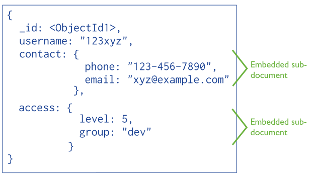
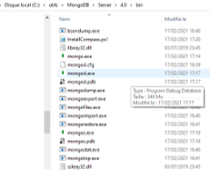

*
:loudspeaker: Bonjour à tous et à toutes :heavy_exclamation_mark:
*
-
---

 
<i class="fas fa-info-circle"></i> Nous verrons dans cette formation sur <mark style="line-height:40px"> Mongo DB (Base) </mark> une nouvelle façon d'exploiter des données sans SQL (et oui, fini la douce joie des clefs primaires et étrangères, adieu les jointures, fini Merise).  

On verra donc comment installer et exploiter l'un des acteurs majeurs du mouvement NO-SQL permettant de traiter des masses immenses de données, le [Big Data <i class="fas fa-database fa-2x"></i> <i class="fas fa-external-link-alt"></i>](https://fr.wikipedia.org/wiki/Big_data), à ne pas confondre avec notre version française, le [Big Bisous <i class="far fa-kiss-beam fa-2x"></i> <i class="fas fa-external-link-alt"></i>](https://www.youtube.com/watch?v=wcQXW5mje70).

Cette première formation nous donnera tous les outils pour bien démarrer et interroger la base Mongo Db via son shell ou des scripts Javascripts  <i class="fa-brands fa-js fa-lg"></i> et sera suivie d'une version plus approfondie et plus orientée Big Data <i class="fas fa-database fa-2x"></i>.

>  “Ce sont les grandes entreprises du web amenées à traiter des volumes de données très importants qui ont été les premières confrontées aux limitations intrinsèques des SGBD relationnels traditionnels (début années 70).
Afin de répondre à ces limites, ces entreprises ont commencé à développer leurs propres systèmes de gestion de bases de données pouvant fonctionner sur des architectures matérielles distribuées et permettant de traiter des volumes de données importants.”
>- https://www.mongodb.com/fr  
>- https://fr.wikipedia.org/wiki/Voldemort_(syst%C3%A8me_de_fichiers_distribu%C3%A9) 
>- https://cassandra.apache.org/       et d'autres  
>
>Les performances restent bonnes avec la montée en charge en multipliant simplement le nombre de serveurs, solution raisonnable avec la baisse des coûts, en particulier si les revenus croissent en même temps que l'activité. Les systèmes géants sont les premiers concernés : énormes quantités de données, structuration relationnelle faible (ou de moindre importance que la capacité d'accès très rapide, quitte à multiplier les serveurs).
>
>Un modèle typique en NoSQL (début 2000) est le système clé-valeur, avec une base de données pouvant se résumer topologiquement à un simple tableau associatif unidimensionnel avec des millions — voire des milliards — d'entrées. Parmi les applications typiques, on retrouve des analyses temps-réel, statistiques, du stockage de logs (journaux), flux vidéo ou audio, texte brut, données de géolocalisation, images, etc. . .
>
> <cite>[  Wikipedia <i class="fas fa-external-link-alt"></i>](https://fr.wikipedia.org/wiki/NoSQL "Définition à lire pour bien comprendre")</cite>
>

C’est MongoDB qui est la plus utilisée à l’heure actuelle, sa première version sort en 2009.  
- MongoDB est  une base de données dite « orientée document »
  - Le document n’a pas une structure figée et prédictible : Deux documents peuvent très bien contenir les mêmes champs, mais dans un ordre totalement différent (alors qu’en SGBD relationnel on se doit de respecter le modèle relationnel régissant les tables)
  - Dans un document, un champ sans valeur peut tout simplement en être absent (NULL en SQL)
  - Dans une base de données orientée document, il peut y avoir autant de formats de données qu’il y a de documents (contrairement au SQL ou on défini un type (VARCHAR, BYTE etc)), ces BDD sont dites schema-less (sans schéma)
  -  PAS DE [CIF <i class="fas fa-external-link-alt" ></i>](https://merise.developpez.com/faq/?page=MCD#CIF-ou-dependance-fonctionnelle-de-A-a-Z) ni de clé étrangères avec MongoDB 

  - C’est une nouvelle façon de concevoir la structure des données (vous ne pourrez pas faire de relationnel !!!)  

https://docs.mongodb.com/manual/core/data-model-design/

 
Paramétrons notre environnement de développement afin de gagner du temps le premier jour :

## <i class="fas fa-clipboard-list "></i> TODO  :roller_coaster::

- Pour ceux qui n'ont pas encore fait l'installation d'une LAMP via WSL sous windows (note : pour ceux sur *linux* pas besoin d'installer <i class="fa-brands fa-linux fa-lg"></i> linux hein :P)[->ICI <i class="fas fa-external-link-alt"></i><- ](https://francis-panzani.github.io/posts/divers/wsl_w10/), suivez les instructions suivantes :
  - Pour ceux qui sont sur <i class="fa-brands fa-linux fa-lg"></i> Linux, suivez les instructions de la communauté qui se trouvent [-><i class="fa-brands fa-ubuntu" style="color: #ff8800;"></i> ICI <i class="fas fa-external-link-alt"></i><- ](https://doc.ubuntu-fr.org/mongodb)
  - Pour ceux qui sont sur <i class="fab fa-windows"></i> Windows : Installer  <i class="fa-brands fa-ubuntu" style="color: #ff8800;"></i> 20.04 sur une WSL en suivant les tutoriels qui se trouvent [-> ICI <i class="fas fa-external-link-alt"></i><- ](https://docs.microsoft.com/fr-fr/windows/wsl/install-win10 )  ou  [->LA <i class="fas fa-external-link-alt"></i><- ](https://www.microsoft.com/fr-fr/p/ubuntu-2004-lts/9n6svws3rx71?rtc=1&activetab=pivot:overviewtab)   

- Ensuite `Télécharger` *PUIS* `installer` MongoDB 4.0 ou 3.6  :[->ICI <i class="fas fa-external-link-alt"></i><-](https://docs.mongodb.com/manual/tutorial/install-mongodb-on-windows/).
  - On l’installera dans un <i class="far fa-folder"></i> dossier spécifique (par exemple c:/utils/MongoDb), afin d'y retourner plus facilement plus tard.

- Et enfin, `Télécharger` *PUIS* `installer` Compass :[->ICI <i class="fas fa-external-link-alt"></i><- ](https://www.mongodb.com/try/download/compass).

*Les  principaux composants de MongoDB sont :*
- mongod, le programme principal. Il gère l’accès aux données et effectue en tâche de fond des opérations de gestion de données.
- mongos, le routeur qui gère l’acheminement des requêtes en environnement distribué. Lorsque les données sont distribuées sur des shards, c’est ce processus qui gère l’accès à celles-ci.
- mongo, le programme d’interaction en ligne de commande avec la base de données que nous désignerons dans ces pages sous le nom de shell. L’interaction avec la base de données se fait au moyen du langage JavaScript, dont il vous faut connaître les rudiments.

:mortar_board: [Afin de débuter la Formation sur MongoDB Base ensemble, vous aurez besoin de suivre les instructions du :books:support suivant et/ou de récupérer les éléments de la  apsule : (Logins & Passswords :closed_lock_with_key: donnés par le formateur &nbsp; <i class="fas fa-chalkboard-teacher"></i> &nbsp;)&nbsp; <i class="fas fa-external-link-alt"></i>.](http://franpan.free.fr/formation/_mongobase521 "lien vers le site contenant les fichiers de la formation")

Merci de garder pour vous les ressources que vous y trouverez et de ne pas les diffuser :smirk:  
Merci de m'avertir de toute erreur ou coquille qui m'auraient échapées :heart_eyes:

:copyright: :no_entry_sign: Do not distribute    :relieved: