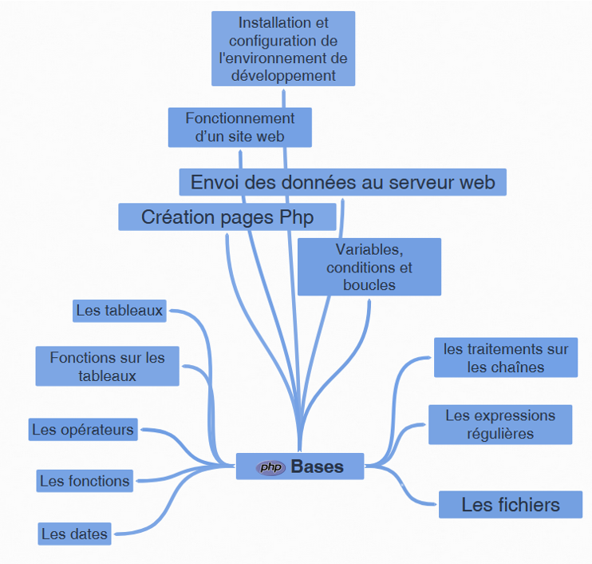
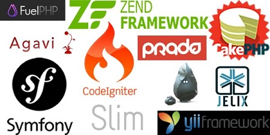
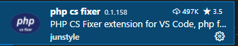
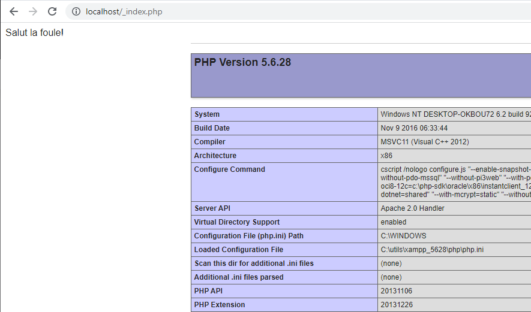

*<center>:loudspeaker: Bonjour à tous et à toutes :heavy_exclamation_mark:</center>*
-

<div class="d-sm-block alert alert-info text-center" > 
<i class="fas fa-info-circle " style="color: blue;"></i> Nous verrons dans ce premier niveau de la formation sur  les fondamentaux, ses principales fonctions et structures de contrôle, ainsi que des explications sur la transmission des données entre les <i class="fas fa-file-code"></i> pages et donc l’essentiel pour bien débuter avec ce <a href="https://fr.wikipedia.org/wiki/Langage_serveur">  langage de script coté <i class="fas fa-server"></i> serveur  <i class="fas fa-external-link-alt"></i></a> très utilisé pour les <i class="fas fa-sitemap"></i> sites internet et les <i class="fas fa-file-code"></i> pages web.<br/>
La formation dans ses débuts sera très axé sur l'excellent travail de mon ancien collègue, <a href="https://www.editions-eni.fr/supports-de-cours/recherche?exp=olivier%20rollet"><mark> Olivier ROLLET</mark>, Ingénieur maître et auteur chez les éditions Eni dont vous pouvez trouver ses livres -> :books: ICI <i class="fas fa-external-link-alt"></i> <-</a>
</div>

<div class="float-right img-fluid"  >


</div>

><i class="fab fa-php fa-2x" style="color:blue; vertical-align:middle;"></i> :“ Hypertext Preprocessor, est un [langage de programmation libre <i class="fas fa-external-link-alt"></i>](https://fr.wikipedia.org/wiki/Logiciel_libre) , principalement utilisé pour produire des pages Web dynamiques via un <i class="fas fa-server"></i> serveur HTTP, mais pouvant également fonctionner comme n'importe quel langage interprété de façon locale.
>PHP est un langage impératif orienté objet.
>
>PHP a permis de créer un grand nombre de sites web célèbres, comme Facebook et Wikipédia. <strong><i>Il est considéré comme une des bases de la création de sites web dits <mark> [dynamiques <i class="fas fa-external-link-alt"></i>](https://fr.wikipedia.org/wiki/Page_web_dynamique) </mark> </strong></i> mais également des applications web.
>
> Il a été conçu pour permettre la création d'applications dynamiques, le plus souvent développées pour le Web. PHP est le plus souvent couplé à un serveur Apache bien qu'il puisse être installé sur la plupart des serveurs HTTP tels que IIS ou nginx.  
>Ce couplage permet de récupérer des informations issues d'une <i class="fas fa-database"></i> base de données [(très souvent MySQL ou MariaDb) <i class="fas fa-external-link-alt"></i>](https://fr.wikipedia.org/wiki/MySQL#Utilisation), d'un système de fichiers (contenu de fichiers et de l'arborescence) ou plus simplement des données envoyées par le navigateur afin d'être interprétées ou stockées pour une utilisation ultérieure.”  
> <cite>[  Wikipedia <i class="fas fa-external-link-alt"></i>](https://fr.wikipedia.org/wiki/PHP "Définition à lire pour bien comprendre")</cite>
>
> <hr/>
>
><i class="fab fa-php fa-2x" style="color:blue; vertical-align:middle;" ></i>“
Au lieu d'utiliser des tonnes de commandes afin d'afficher du HTML (comme en C ou en Perl), les pages PHP contiennent des fragments HTML dont du code qui fait "quelque chose" (dans ce cas, il va afficher "Bonjour, je suis un script PHP !").<br/>
>Le code PHP est inclus entre une balise de début `<?php `et une balise de fin` ?>` qui permettent au serveur web de passer en mode PHP.
>
>Ce qui distingue PHP des langages de script comme le Javascript, est que le code <mark> est exécuté sur le serveur</mark> , générant ainsi le HTML, qui sera ensuite envoyé au client.  
>Le client ne reçoit que le résultat du script, sans aucun moyen d'avoir accès au code qui a produit ce résultat. Vous pouvez configurer votre serveur web afin qu'il analyse tous vos fichiers HTML comme des fichiers PHP.  
>Ainsi, il n'y a aucun moyen de distinguer les pages qui sont produites dynamiquement des pages statiques.”
>
> <cite>[.net <i class="fas fa-external-link-alt"></i>](https://www.php.net/manual/fr/intro-whatis.php "Définition à lire pour bien comprendre")</cite>  

   Je vous invite à lire l'`Introduction au Web dynamique` [-> ICI <- <i class="fas fa-external-link-alt"></i>](http://romainlebreton.github.io/ProgWeb-CoteServeur/classes/class1.html "Définition à lire pour bien comprendre") afin de mieux comprendre les différences entre sites statiques et dynamiques ainsi que le rôle de Php.
   		
<link rel="stylesheet" href="minified/bootstrap-gallery.min.css">
<script src="https://code.jquery.com/jquery-3.3.1.slim.min.js" integrity="sha384-q8i/X+965DzO0rT7abK41JStQIAqVgRVzpbzo5smXKp4YfRvH+8abtTE1Pi6jizo" crossorigin="anonymous"></script>
<script src="minified/bootstrap-gallery.min.js"></script>
<div class="row">
  <div class="col-6 col-sm-3">
    <a href="/images/carte_conceptuelle_du_logiciel_libre.svg.png" class="thumbnail">
      
    </a>
  </div>
 <div class="col-6 col-sm-3">
    <a href="sitedynaphp.png" class="thumbnail">
      
    </a>
  </div>
  <div class="col-6 col-sm-3">
    <a href="frameworks-PHP.jpg" class="thumbnail" >
      
    </a>
  </div>
  <div class="col-6 col-sm-3">
    <a href="php_cms.png" class="thumbnail">
      
    </a>
  </div>
</div>


Si vous avez bien tout lu vous serez arrivé à la conclusion que PhP est idéal pour les débutants et qu'il a beaucoup de fonctions avancées.  
Il rajoute une couche de <i class="fas fa-shield-alt"></i> sécurité non négligeable à nos pages web (on va plus se faire piquer notre code comme ça :tongue:).  
:closed_lock_with_key: On va surtout pouvoir stocker coté serveur (et donc de façon protégée) nos logins et mots de passes afin d'accéder à nos bases de données ou à des applications Web Externe sécurisées.


<div class="d-sm-block  alert alert-dark text-left" role="alert">

Paramétrons notre [environnement de développement (IDE) <i class="fas fa-external-link-alt"></i>](https://fr.wikipedia.org/wiki/Environnement_de_d%C3%A9veloppement) afin de gagner du temps le premier jour de la formation :

</div>

## <i class="fas fa-clipboard-list "></i> TODO :roller_coaster::

  <h4> 1.Dans un premier temps on va Installer puis configurer un éditeur de code : Visual Studio Code  : </h4>  Il devient un incontournable (en gratuit, merci crocsoft au passage) des éditeurs légers :

 - `Télécharger` _PUIS_ `installer` Visual Studio Code  :[->ICI <i class="fas fa-external-link-alt"></i><- ](https://code.visualstudio.com/).
 - Installer les extensions <i class="fab fa-php fa-2x" style="color:blue; vertical-align:middle;" ></i>ci-dessous pour VSC : <kbd>CTRL + SHIFT + X</kbd> puis tapez,` PHP Debug` (on s'en servira plus tard), `PHP IntelliSense` (pour le linter et des aides très pratiques), `php cs fixer` (pour le formattage du texte via <kbd>CTRL + SHIFT + H</kbd>)


  <div  class="row justify-content-center">
  
    
    
  </div>

  - Il faudra peut-être redémarrer entre-temps VSC, faites lui plaisir : faites-le s'il vous le demande.
  - Avant d'ouvrir un répertoire de travail via les manipulations que l'on a vues dans le support sur  [->Javascript Niveau 1<-](../../formation_js/lvl1) on va installer notre serveur php (si cela n'a pas déjà été fait).
  
<h4> 2.Dans un second temps on suit le tuto d'installation d'un serveur web (XAMPP)</h4> 

[->Tuto installation Xampp (la 5.6.2.8 dans un premier temps ) ICI<-](../../../divers/installation_xampp)

<h4> 3.Pour finir ouvrons notre dossier de publication de notre serveur web et éditons à nouveau le fichier index.php</h4> 

- renommons le en _index.php puis écrivons à l'intérieur le code suivant : 
 ```php
<?php
# Un premier commentaire en php
// Une autre façon d'avoir un commentaire
echo "Salut "." la "." foule !"; //echo affiche en sortie standard, la concaténation se fait via le '.'
$mavariablephp="<hr>";
echo ($mavariablephp);// on peut bien évidemment demander d'afficher du code html
phpinfo(); //appel a une fonction php qui affiche les variables du serveurs (on en aura besoin avec Xdebug plus tard)
 ```

- Ce qui nous donne quand on affiche le rendu : 
  <div  class="row justify-content-center">
  
  </div>


<div class="d-sm-block  alert alert-success  text-left" role="alert">
Vous avez pu tout faire c'est super :+1: :muscle: , sinon redonnez-vous une chance, au pire on verra ça rapidement le premier jour.  

:speech_balloon: Maintenant que l'on a configurer notre environnement de développement et que l'on a un premier fichier pour démarrer, on peut passer à la formation :astronaut: :  

:mortar_board: [Afin de débuter la Formation sur PhP niveau 1 ensemble, vous aurez besoin de suivre les instructions du :books:support suivant et/ou de récupérer les éléments de la apsule : (Logins & Passswords :closed_lock_with_key: donnés par le formateur <i class="fas fa-chalkboard-teacher"></i> ) <i class="fas fa-external-link-alt"></i>.](http://franpan.free.fr/formation/_php401 "lien vers le site contenant les fichiers de la formation")

</div>

Merci de garder pour vous les ressources que vous y trouverez et de ne pas les diffuser :smirk:  
Merci de m'avertir de toute erreur ou coquille qui m'auraient échapées :heart_eyes:

:copyright: :no_entry_sign: Do not distribute :relieved:
