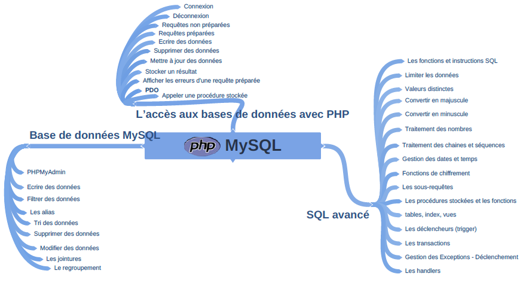

## _
:loudspeaker: Bonjour à tous et à toutes :heavy_exclamation_mark:
_

---
<link rel="stylesheet" href="https://cdn.jsdelivr.net/npm/bootstrap-icons@1.8.1/font/bootstrap-icons.css">

 

<i class="fas fa-info-circle " style="color: blue;"></i>  Nous verrons dans ce 3️⃣ ieme niveau de la formation sur <i class="fab fa-php fa-2x" style="color:blue; vertical-align:middle;"></i>

- Comment comprendre le langage MySQL et gérer la base de données à l’aide PHPMyAdmin
- Utiliser le langage SQL en visant une pratique optimale, pour développer des applications performantes accédant aux bases de données.
- Interagir entre les pages PHP et les bases de données MySQL en gérant la sécurité.
- et bien d'autres choses encore *selon le temps et l'avancée* :pancakes:

 
Liste non exhaustive de ce que l'on pourra aborder :

  

  
   

## <i class="fas fa-clipboard-list "></i> TODO :roller_coaster::
:speech_balloon: Vous devez avoir obligatoirement configuré votre environnement de développement avec les intructions (partie TODO :roller_coaster:) données précédemment <i class="fas fa-clipboard-list "></i> :  

- :point_right: Dans la partie php Lvl 1 [->ICI<-](../lvl1/)

- :point_right: Dans l'installation d'un serveur web (XAMPP) [->ICI<-](../../../divers/installation_xampp)

:mortar_board: [Afin de débuter la Formation sur **<i class="fab fa-php fa-2x" style="color:blue; vertical-align:middle;"></i> niveau 3** ensemble, vous aurez besoin de suivre les instructions du :books:support suivant et/ou de récupérer les éléments de la  apsule : (Logins & Passswords :closed_lock_with_key: donnés par le formateur &nbsp; <i class="fas fa-chalkboard-teacher"></i> &nbsp;)&nbsp; <i class="fas fa-external-link-alt"></i>.](http://franpan.free.fr/formation/_php403 "lien vers le site contenant les fichiers de la formation")

Merci de garder pour vous les ressources que vous y trouverez et de ne pas les diffuser :smirk:  
Merci de m'avertir de toute erreur ou coquille qui m'auraient échapées :heart_eyes:

:copyright: :no_entry_sign: Do not distribute :relieved: