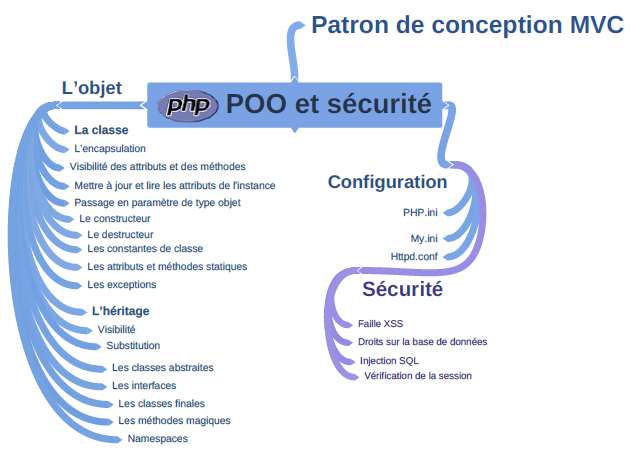

## _
:loudspeaker: Bonjour à tous et à toutes :heavy_exclamation_mark:
_

---

 
<i class="fas fa-info-circle " style="color: blue;"></i> Nous verrons dans ce :four:ieme niveau de la formation sur 

- Comment avoir une approche du développement orienté objet (POO) 
- Savoir comprendre les fichiers de configuration et les techniques pour sécuriser son site web.
- Comprendre la notion d’Objet.
- Aller plus loin dans la sécurité avec PhP
- Découvrir le patron de conception MVC
- et bien d'autres choses encore *selon le temps et l'avancée* :pancakes:

Liste non exhaustive de ce que l'on pourra aborder :
  

  
   

## <i class="fas fa-clipboard-list "></i> TODO :roller_coaster::
:speech_balloon: Vous devez avoir obligatoirement configuré votre environnement de développement avec les intructions (partie TODO :roller_coaster:) données précédemment <i class="fas fa-clipboard-list "></i> :  

- :point_right: Dans la partie php Lvl 1 [->ICI<-](../lvl1/)

- :point_right: Dans l'installation d'un serveur web (XAMPP) [->ICI<-](../../../divers/installation_xampp)

:mortar_board: [Afin de débuter la Formation sur **PhP Lvl4** ensemble, vous aurez besoin de suivre les instructions du :books:support suivant et/ou de récupérer les éléments de la apsule : (Logins & Passswords :closed_lock_with_key: donnés par le formateur <i class="fas fa-chalkboard-teacher"></i> ) <i class="fas fa-external-link-alt"></i>.](http://franpan.free.fr/formation/_php404 "lien vers le site contenant les fichiers de la formation")

Merci de garder pour vous les ressources que vous y trouverez et de ne pas les diffuser :smirk:  
Merci de m'avertir de toute erreur ou coquille qui m'auraient échapées :heart_eyes:

:copyright: :no_entry_sign: Do not distribute :relieved: