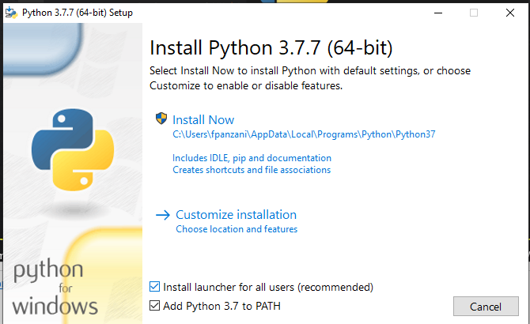
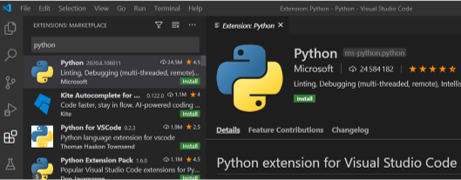
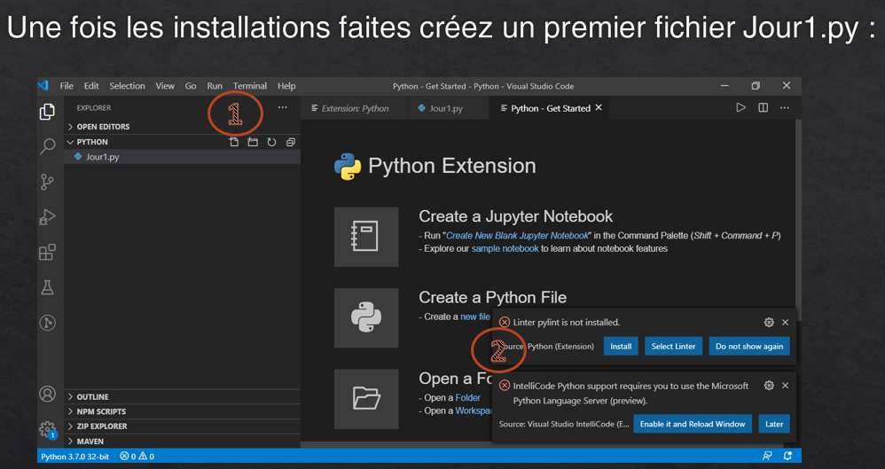
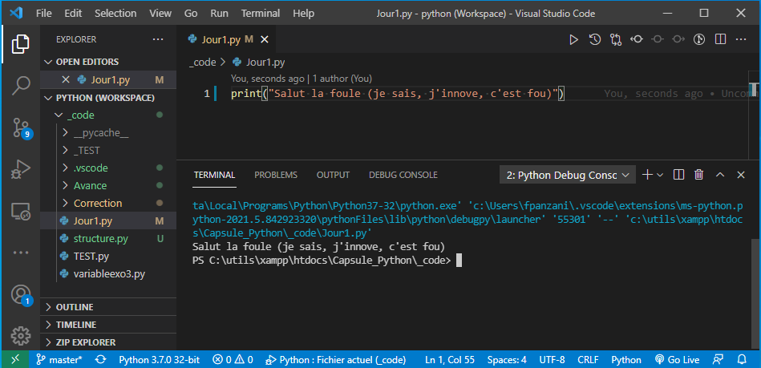

*
:loudspeaker: Bonjour à tous et à toutes :heavy_exclamation_mark:
*
-
---

    &nbsp;Dans cette formation on verra comment installer, configurer <mark>Python V3</mark> et le prendre en main.  

Que l'on soit débutant, avec une mise en relation poussée avec l'algorithmique, jusqu'à un niveau avancé afin de l'utiliser pour faire des scripts d'utilisation et des logiciels graphiques (si si c'est possible) vous pourrez progresser et prendre plaisir à l'utiliser.

> “ Python est un langage de programmation interprété, multi-paradigme et multiplateformes. Il favorise la programmation impérative structurée, fonctionnelle et orientée objet.   
Il est doté d'un typage dynamique fort, d'une gestion automatique de la mémoire par ramasse-miettes et d'un système de gestion d'exceptions ; il est ainsi similaire à Perl, Ruby, Scheme, Smalltalk et Tcl.”
>
> <cite>[  Wikipedia <i class="fas fa-external-link-alt"></i>](https://fr.wikipedia.org/wiki/Python_(langage) "Définition à lire pour bien comprendre")</cite>

>  “Python est un langage de programmation puissant et facile à apprendre. Il dispose de structures de données de haut niveau et permet une approche simple mais efficace de la programmation orientée objet. Parce que sa syntaxe est élégante, que son typage est dynamique et qu'il est interprété, Python est un langage idéal pour l'écriture de scripts et le développement rapide d'applications dans de nombreux domaines et sur la plupart des plateformes.  L'interpréteur Python et sa vaste bibliothèque standard sont disponibles librement, sous forme de sources ou de binaires, pour toutes les plateformes majeures depuis le site Internet https://www.python.org/ et peuvent être librement redistribués. ”
>
> -- <cite>[Site Officiel <i class="fas fa-external-link-alt"></i>](https://docs.python.org/fr/3/tutorial/)</cite>

Bon vous l'aurez compris, il est gratuit (chouette) car open source, facile (on l'utilise dès le collège maintenant pour apprendre les bases de l'algo), d'une syntaxe très proche de l'algorithmie et il est très très utilisé dans le monde de l'enseignement.
En plus on peut facilement inclure des éléments supplémentaires (librairies par exemple) pour faire des programmes très poussés (il est aussi très présent dans les formations Big Data jusqu'au bac +5).

Pour nous on le verra ensemble dès les premieres années en liaison avec l'algo puis on y (re)viendra dans d'autres classes notamment pour son coté scripting.

Paramétrons notre environnement de développement afin de pouvoir démarrer la formation : 
## TODO  :roller_coaster:: 
- `Télécharger` *PUIS* `installer` Python 3.7 :[->ICI <i class="fas fa-external-link-alt"></i><-](https://www.python.org/downloads/release/python-370/)
 - Prenez une version avec un `exécutable ou un installateur` pour vous simplifier la vie
 - A grand coup de Next, par contre on installe python dans le path puis tant qu'a faire on en fait profiter tout le monde (des fois qu'on change de session, on sera pas perdu :P)

 Bon ok je suis sous Windows (mais c'est obligé pour le boulot).  Mais vous, vous pouvez l'installez sous linux ou Mac pour les amateurs de la pomme 

- `Télécharger` *PUIS* `installer`  Visual Studio Code :[->ICI <i class="fas fa-external-link-alt"></i><-](https://code.visualstudio.com/)

- Installer l’extension Python pour VSC <kbd>CTRL + SHIFT + X</kbd> puis tappez Python, c'est simple c'est la plus téléchargée (donc tout en haut).

- Il faudra peut etre redémarrer entre-temps VSC, faites lui plaisir, faites le s'il vous le demande.
- Ouvrez un répertoire de travail File -> Open Folder puis
- On va dans le menu des fichiers en haut a gauche <kbd>CTRL + SHIFT + E</kbd> et 

- Puis soit on clique sur le symbole situé en 1 soit on fait File -> New file, soit on fait <kbd>CTRL + N</kbd> pour créer un nouveau fichier que l'on va enregistrer <kbd>CTRL + S</kbd> en tant que jour1`.py` *(`.py` et pas .pi ou .po car sinon ça ne marchera pas !!!)*
- Ensuite on entre dedans le code suivant : <code> print("Salut la foule (je sais, j'innove, c'est fou)"))</code>
- Bon maintenant qu'on a installer le python et sa suite logicielle sur votre ordinateur (suite de logiciels qui interprète les fichiers en `.py` pour les exécuter), on va l'exécuter afin de voir ce que cela donne : 
- Pour ce faire on fait en haut Run -> Run without debuggung ou <kbd>CTRL + F5</kbd>

- Et là en bas s'affiche notre fameuse phrase que le monde nous envie... Bon la machine nous dit bonjour, on l'a rendue polie, c'est déjà çà.

Vous pouvez en apprendre plus en suivant le site officiel ou le tuto ici : https://docs.microsoft.com/fr-fr/windows/python/beginners 

:mortar_board: [Afin de débuter la Formation sur Python ensemble, vous aurez besoin de suivre les instructions du :books:support suivant et/ou de récupérer les éléments de la  apsule : (Logins & Passswords :closed_lock_with_key: donnés par le formateur &nbsp; <i class="fas fa-chalkboard-teacher"></i> &nbsp;)&nbsp; <i class="fas fa-external-link-alt"></i>.](http://franpan.free.fr/formation/_python911 "lien vers le site contenant les fichiers de la formation")

Merci de garder pour vous les ressources que vous y trouverez et de ne pas les diffuser :smirk:  
Merci de m'avertir de toute erreur ou coquille qui m'auraient échapées :heart_eyes:

:copyright: :no_entry_sign: Do not distribute    :relieved: