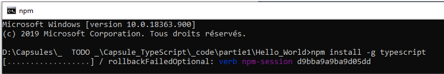
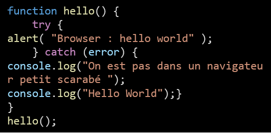
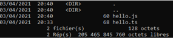
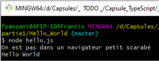
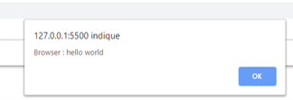

*<center>:loudspeaker: Bonjour à tous et à toutes :heavy_exclamation_mark:</center>*
-
---
Dans cette formation on verra comment installer et configurer TypeScript, le prendre en main, faire un tour de ce qu'il a apporté a Javascript (ECMA 6), ça sera une bonne préparation pour la Formation sur Angular.  

*Passons en revue ses caractéristiques* :
- [x] TypeScript est un langage de programmation libre et open source développé par Microsoft qui a pour but d'améliorer et de sécuriser la production de code JavaScript.  
- [x] Son contributeur principal estAnders Hejlsberg, créateur de Delphi,Turbo Pascal et principal inventeur de C#.  
- [x] C'est un sur-ensemble ou sur-couche de JavaScript (cela signifie que JavaScript est inclus dans TypeScript qui ajoute ce qui semble manquer au langage).   
- [x] L’ensemble des fonctionnalités supplémentaires permet au langage de se rapprocher de ses concurrents célèbres et populaires tels que Java et C++.  
- [x] Typescript supporte ECMA 6.  
- [x] Les dernières versions de JavaScript (à partir d’ECMAScript 2015) reprennent ces évolutions. Elles devraient donc se généraliser au fur et à mesure des mises à jour des moteurs JavaScript au sein des navigateurs.  
- [x] Le code TypeScript est transcompilé via un transpileur ou transcodeur nommé tsc.Plus simplement, l’ensemble du code est transformé en JavaScript et peut ensuite être interprété par n'importe quel navigateur web ou moteur JavaScript.  
- [x] TypeScript permet d'utiliser via des en-têtes TypeScript de nombreuses bibliothèques populaires comme JQuery, MongoDB, D3.JS, Node.js.  
- [x] Angular s'appuie beaucoup dessus c'est pourquoi il est très souvent vu au début de tout apprentissage sur ce Framewwork Web.  
- [x] Sorti en 2012, ses fichiers sont en .ts, le site off:  https://www.typescriptlang.org/    


En gros c'est une sur-couche de JavaScript qui permet de : 
- Typer optionnellement les variables lors de leurs déclarations (typage statique).
- Gérer des paramètres optionnels (en ajoutant un point d’interrogation accolé à leurs noms).
- Créer des classes et les instancier.
- Gérer un héritage simplifié.
- Implémenter des interfaces (au sens de la programmation objet).
- Gérer l’accès aux attributs par trois mots réservés : public, protected, private.

## TODO  :roller_coaster:: 

- Installez la version node-v10.24.1 [->ICI<-](https://nodejs.org/dist/latest-v10.x/)

- Puis créons un dossier Hello_World et lançons y la commande shell : 
```bash
npm install -g typescript
```
<center> </center>
<br/>


- Puis créons via [Visual Studio Code](https://code.visualstudio.com/download) un fichier `hello.ts` 
  - Rentrons y le code Javascript suivant :  
  <center> </center>  

  - _C'est pour la demo, on verra pour le typescript pur plus tard, no stress ;)_  
- Afin de transcompiler le fichier et de l’intégrer à une page HTML, la commande à lancer dans un terminal Windows est  :
```shell
tsc hello.ts
 ```
 
- Ce qui va nous créer un fichier du même nom mais en .js que l'on va pouvoir lancer avec Node.js via la commande node hello.js    
<br/><br/>
- Pour rappel Node.js sert a écrire des applications type serveur et desktop en javascript, ce n'est pas un browser, mais on peut inclure notre .js dans un .html afin de l'interpreter via notre navigateur préféré ;)   




<div class="d-sm-block  alert alert-success  text-left" role="alert">

:mortar_board: [Afin de débuter la Formation sur TypeScript ensemble, vous aurez besoin de suivre les instructions du :books:support suivant et/ou de récupérer les éléments de la <span style='display:FLEX;margin:0'> apsule : (Logins & Passswords :closed_lock_with_key: donnés par le formateur &nbsp; <i class="fas fa-chalkboard-teacher"></i> &nbsp;)&nbsp; <i class="fas fa-external-link-alt"></i>.</span>](http://franpan.free.fr/formation/_typescript321 "lien vers le site contenant les fichiers de la formation")


</div>

Merci de garder pour vous les ressources que vous y trouverez et de ne pas les diffuser :smirk:  
Merci de m'avertir de toute erreur ou coquille qui m'auraient échapées :heart_eyes:

:copyright: :no_entry_sign: Do not distribute    :relieved:
