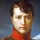
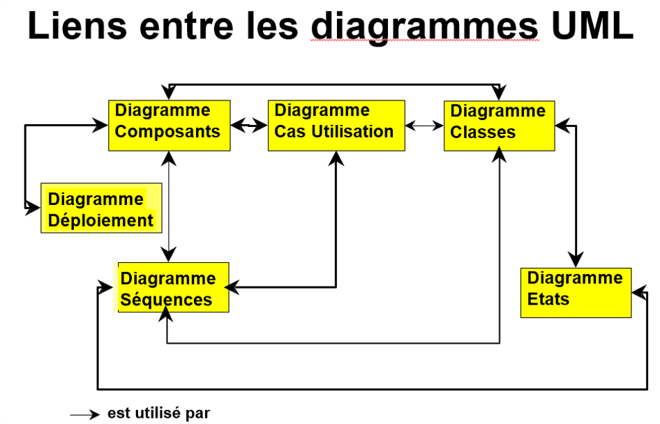

*
:loudspeaker: Bonjour à tous et à toutes :heavy_exclamation_mark:
*
-
---

## Bienvenue sur cette partie traitant de la formation à UML :smiley:
On verra ici ce qu'est UML (dispensé jusqu'en bac +3 /4 et oui, vous n'avez pas fini d'en entendre parler).  
*U*nified *M*odeling *L*anguage ou en français Langage de Modélisation Unifié est un langage de  modélisation graphique à base de pictogrammes conçu pour fournir une méthode normalisée pour visualiser la conception d'un système.

>  “Un bon croquis vaut mieux qu’un long discours.”
>
> -- <cite>[Napoléon Bonaparte](http://evene.lefigaro.fr/citation/bon-croquis-vaut-mieux-long-discours-37319.php)</cite>

Il est couramment utilisé en Développement Logiciel et en Conception Orientée Objet.  
L'UML est le résultat de la fusion de précédents langages de modélisation objet : Booch, OMT, OOSE 

UML est à présent un standard adopté par l'Object Management Group (OMG) -> consortium américain à but non lucratif créé en 1989 dont l'objectif est de standardiser et promouvoir le modèle objet.   
La dernière version de la spécification validée par l'OMG est UML 2.5.1 (2017)2.

Pour faire simple a un moment il y avait beaucoup de façon de représenter des systemes d'informations ou des projets informatique (Il reste encore beaucoup de diversités mais maintenant on a au moins une base commune), il y a eu un gros besoin de standardisation qui s'est traduite en 1997 par la V1 d'UML.  
Le langage Uml est mondialement connu et reste encore très utilisé et très enseigné, ou en tout cas certains de ses diagrammes le sont encore quasi dans tous les projets informatiques d'une taille conséquente même après l'avenement des méthodologies Agiles.  

Il est composé de 14 diagrammes, on en verra un certain nombre à des moments divers de votre parcours avec moi, ces diagrammes se suivent et s'enrichissent des précédents diagrammes en permettant de construire une application Informatique (mais pas que) des étapes de conception au déploiement, en passant bien évideement par la réalisation !!!

### Diagramme de Cas d’Utilisation
C'est le premier, il permet de visualiser les Uses Cases (Cas d'utilisation,) a ne pas confondre avec les Users Sorties des méthodologiees Agiles).  

Son but : 
- Modéliser ce que l ’application doit (ou ne doit pas) être capable de prendre en compte.
- Modélise la manière dont une organisation ou un système externe doivent interagir avec le système.  

Coté Utilisateur : 
- Met en évidence les services du système
- Fixe le périmètre entre le système et son environnement
### Diagramme de Séquence
Il  permet la représentation de façon séquentielle du déroulement des traitements et des interactions entre les éléments du système et/ou de ses acteurs.

Son but : 
- Validation des cas d ’utilisation, pour comprendre la logique de l ’application.
- Complète le diagramme des cas d’utilisation en mettant en évidence les objets et leurs  Interactions d’un point de vue temporel.  

Note : Pas tout le temps nécessaire.

### Diagramme de Classe 
Ultra important, c'est la représentation des classes intervenant dans le système (Il est le point central de la modélisation du système pour décrire ce que le système doit faire (analyse) et comment il va le faire (conception)).  

Son but : 
- Représentation de la structure statique du système d’information 
- Modélisation des classes et de leurs relations 

### Diagramme d’État Transition
Il est la représentation du cycle de vie des instances d’une classe.  

Son but : 
- Spécification des états, des transitions entre ces états et des actions associées aux transitions.
- S’utilise pour la modélisation de la dynamique de certaines classes
   
### Diagramme de Paquetages 
Un Diagramme de package permet de représenter les dépendances entre les différents package du système.  
### Diagramme d’Activité     
Il est la représentation sous forme de flux ou d'enchaînement d'activités du comportement du système ou de ses composants.  
Les activités sont soit : 
- une opération
- une étape dans une opération
- une action d’un scénario d’un cas d ’utilisation  

Il permet de :
- représenter soit un processus d’une organisation
- ou alors le comportement des opérations d ’une classe

Il permet plusieurs points de vue pour :
- soit pour analyser un processus
- soit pour concevoir un objet

### Diagramme de Composants
Il permet la description des composants logiciels (composants du système d'un point de vue physique) et de leurs dépendances, tels qu'ils sont mis en œuvre (fichiers, librairies, bases de données, exécutables …)

Note : Utilisé en conception de logiciel pour allouer les classes et objets aux composants
### Diagramme de Déploiement

Son but est de décrire : 
- la configuration matérielle des unités de traitements (hard et soft).
- l’architecture technique, des noeuds et de leur interconnexion.

Note : Les noeuds peuvent être les serveurs, postes de travail et périphériques. Les composants sont alloués aux différents noeuds.

##  Débuter la formation

Dans un premier temps téléchargez, installez et prenez en main l'excellentissime,et gratuit (mais soutenez-le quand même quand vous gagnerez votre vie en partie grâce à lui :P) ! StarUML : https://staruml.io/  

Sinon vous avez un outil gratuit en ligne draw.io : https://app.diagrams.net/  

:mortar_board: [Afin de débuter la Formation sur UML  ensemble, vous aurez besoin de suivre les instructions du  :books:support suivant et/ou de récupérer les éléments de la apsule : (Logins  & Passswords :closed_lock_with_key: donnés par le formateur <i class="fas fa-chalkboard-teacher"></i> ) <i class="fas fa-external-link-alt"></i>.](http://franpan.free.fr/formation/_Uml777 "lien vers le site contenant les fichiers de la formation")

Merci de garder pour vous les ressources que vous y trouverez et de ne pas les diffuser :smirk:  
Merci de m'avertir de toute erreur ou coquille qui m'auraient échapées :heart_eyes:

:copyright: :no_entry_sign: Do not distribute    :relieved:
