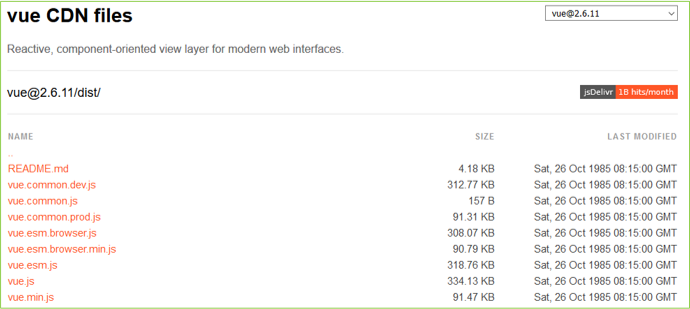

*<center>:loudspeaker: Bonjour à tous et à toutes :heavy_exclamation_mark:</center>*
-
---
<div class="d-sm-block  alert alert-dark" role="alert"> 
<i class="fas fa-info-circle " style="color: green;"></i> Nous verrons dans cette formation sur <mark> <i class="fa-brands fa-vuejs fa-beat fa-xl"></i>ue JS (Base) </mark> , les fondamentaux, l’essentiel pour démarrer avec ce <a href="https://www.wanadev.fr/227-react-vue-angular-quel-framework-front-choisir-en-2021/" title="A lire pour plus d'information"><i class="fas fa-laptop-code"></i> Framework Front <i class="fas fa-external-link-alt"></i></a>  qui prend de plus en plus d'ampleur dans la communauté Javascript <i class="fa-brands fa-js"></i> et sa 
<a href="(https://2020.stateofjs.com/en-US/technologies/"> myriade de <i class="fas fa-toolbox" ></i> Frameworks <i class="fas fa-external-link-alt"></i> </a>


</div>


>  “VueJS a été créé par Evan You  (尤雨溪) après avoir travaillé pour  <i class="fa-brands fa-google"></i>oogle en utilisant   dans plusieurs projets.  
La première version est sortie le 11 février 2014.  
Dans ce support on va travailler avec la version 2.6.11 (du 13 décembre 2019. Ok ça date mais c'est mature et surtout toujours d'actualité, les bases on pas encore changé).  
>
>Vue.js (aussi appelé plus simplement Vue), est un Framework JavaScript [Open-source <i class="far fa-kiss-wink-heart"></i> <i class="fas fa-external-link-alt"></i>](https://fr.wikipedia.org/wiki/Open_source) utilisé pour construire des interfaces utilisateur dynamique, il peut être utilisé pour créer une [SPA (Single Page Application) <i class="fas fa-external-link-alt"></i>](https://fr.wikipedia.org/wiki/Application_web_monopage).  
VueJS a pour objectif de faciliter la création d'applications web dynamiques via la création de composants.  
VueJS est l’un des framework JS les plus léger disponible : l’application *Vue 2.0* complète, compilateur inclus, ne fait que <mark> 23 Ko !</mark>
”
>
> -- <cite>[Wikipedia <i class="fas fa-external-link-alt"></i>](https://fr.wikipedia.org/wiki/Vue.js "Définition à lire pour bien comprendre")</cite>


<i class="fa-brands fa-vuejs fa-xl"></i>ueJS utilise une approche orientée composants ( appelés vues).  

Chaque composant est un bloc qui “se suffit à lui-même” disposant de son propre markup, sa propre logique voire son propre style.  
Cette approche permet un meilleur découpage d’une application et donc une meilleure évolutivité et maintenabilité dans le temps.  
Un des avantages est que les composants peuvent ensuite être réutilisés, ailleurs dans l’application ou même dans un autre projet, et dépendre d’autres composants.


Les composants VueJS disposent de leur propre notation (fichier `.vue`) décomposées ainsi en 3 parties :
1. le markup ou template <i class="fas fa-code"></i>
2. le JavaScript <i class="fab fa-js-square"></i>
3. le style (CSS) <i class="fab fa-css3-alt"></i>

La bibliothèque est notamment utilisée par :


<div class="d-sm-block  alert alert-dark text-left" role="alert"> 
Paramétrons notre environnement de développement afin de gagner du temps le premier jour :
</div>

## <i class="fas fa-clipboard-list "></i> TODO  :roller_coaster::
Dans un premier temps on va apprendre très simplement le framework et on aura besoin uniquement du lien CDN ou du fichier vue.js:  
1. Téléchargez le fichier `vue.js` de la CDN :   https://cdn.jsdelivr.net/npm/vue@2.6.11/dist/


2. Pour aller plus loin dans la formation vous allez avoir besoin d’installer les logiciels suivants :  
- <i class="fa-solid fa-file-lines"></i> Visual Studio Code :  https://code.visualstudio.com/download 
- <i class="fa-brands fa-node fa-2xl"></i> https://nodejs.org/en/download/ (prenez la derniere version si vous ne l'avez pas déjà )
- <i class="fa-brands fa-square-git fa-2xl"></i> : https://git-scm.com/ (prenez la derniere version si vous ne l'avez pas déjà )
- Xampp : https://www.apachefriends.org/download.html (prenez la derniere version si vous ne l'avez pas déjà )  


3. Puis on prépare l'utilisation de l’outil de base (Vue Cli) :  
- Une fois les installations précédentes faites, allez dans le dossier de publication de votre serveur web (Xampp de préférence, pour rappel c'est le dossier `htdocs`)
- Puis créer un dossier pour votre application <i class="fa-brands fa-vuejs fa-xl"></i>ueJS
- Puis lancer à l'intérieur via une invite de commande, un powershell ou le git bash les commandes suivantes :  

```shell
npm install -g @vue/cli
vue –- version 
```

La seconde commande est pour connaitre votre version et verifier que tout s'est bien installé

4. On passe en mode WSL avec une Ubuntu 20.0 pour la fin de la formation (suivez les instructions de mon post [->ICI<-](https://francis-panzani.github.io/posts/divers/wsl_w10/) ou celles qui suivent)
- Pour ceux qui n'ont pas encore fait l'installation d'une LAMP via WSL sous Windows de mon précédent tuto [->ICI <i class="fas fa-external-link-alt"></i><- ](https://francis-panzani.github.io/posts/divers/wsl_w10/), faites-le ou suivez les instructions suivantes :
  - Pour ceux qui sont sur  <i class="fa-brands fa-linux fa-xl"></i> Linux, suivez les instructions de la communauté qui se trouvent [-> <i class="fa-brands fa-ubuntu"></i> ICI <i class="fas fa-external-link-alt"></i><- ](https://doc.ubuntu-fr.org/mongodb)
  - Pour ceux qui sont sur <i class="fab fa-windows"></i> Windows : Installer  <i class="fa-brands fa-ubuntu fa-xl"></i>Ubuntu 20.04 sur une WSL en suivant les tutoriels qui se trouvent [-> ICI <i class="fas fa-external-link-alt"></i><- ](https://docs.microsoft.com/fr-fr/windows/wsl/install-win10 )  ou  [->LA <i class="fas fa-external-link-alt"></i><- ](https://www.microsoft.com/fr-fr/p/ubuntu-2004-lts/9n6svws3rx71?rtc=1&activetab=pivot:overviewtab) <br/><br/>

<div class="d-sm-block  alert alert-success  text-left" role="alert">

:mortar_board: [Afin de débuter la Formation sur <i class="fa-brands fa-vuejs fa-beat fa-xl"></i> VueJS Base ensemble, vous aurez besoin de suivre les instructions du :books:support suivant et/ou de récupérer les éléments de la <span style='display:FLEX;margin:0'> apsule : (Logins & Passswords :closed_lock_with_key: donnés par le formateur &nbsp; <i class="fas fa-chalkboard-teacher"></i> &nbsp;)&nbsp; <i class="fas fa-external-link-alt"></i>.</span>](http://franpan.free.fr/formation/_vuejs999 "lien vers le site contenant les fichiers de la formation")


</div>

Merci de garder pour vous les ressources que vous y trouverez et de ne pas les diffuser :smirk:  
Merci de m'avertir de toute erreur ou coquille qui m'auraient échapées :heart_eyes:

:copyright: :no_entry_sign: Do not distribute    :relieved:
