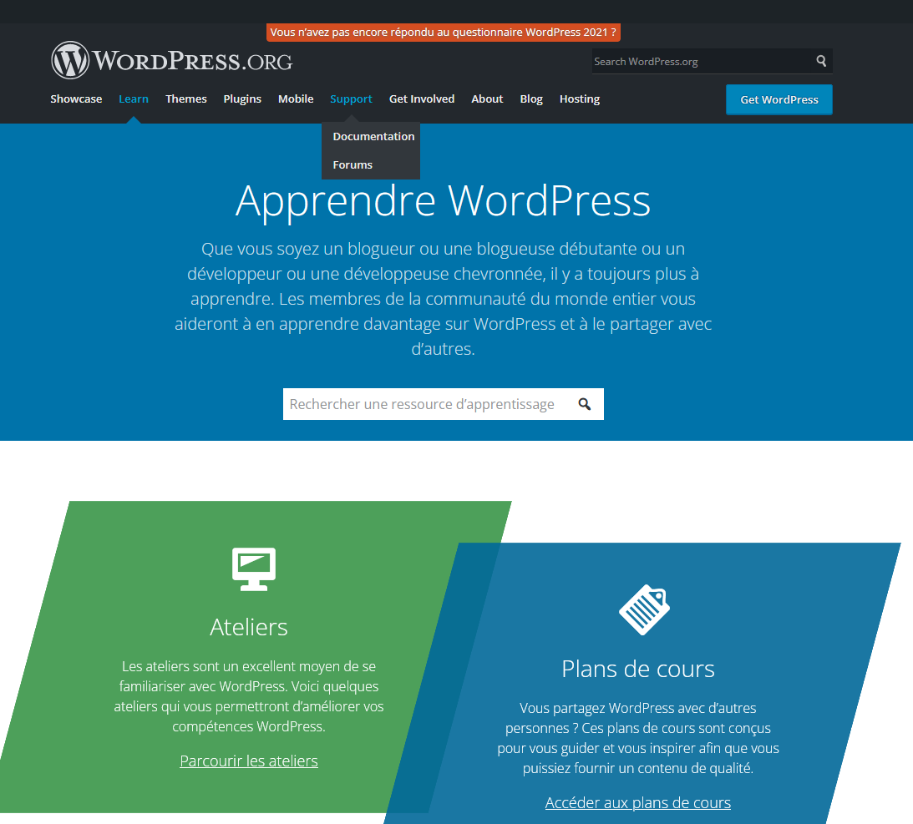

*
:loudspeaker: Bonjour à tous et à toutes :heavy_exclamation_mark:
*
-

 
<i class="fas fa-info-circle " style="color: blue;"></i> Nous débuterons cette formation par une initiation sur  , on traitera les thématiques suivantes : 

- ordPress.com et ordPress.org
- C'est quoi WordPress ?
- ordPress comme Système de gestion de contenu ou CMS
- Pourquoi WordPress ? 
- Les ressources WordPress et bien d'autres choses encore *selon le temps et l'avancée* :pancakes:

> “WordPress est un système de gestion de contenu (SGC ou content management system (CMS) en anglais) gratuit, libre et open-source.  
> Ce logiciel écrit en PHP repose sur une base de données MySQL et est distribué par la fondation WordPress.org.  
> Les fonctionnalités de WordPress lui permettent de créer et gérer différents types de sites Web : site vitrine, site de vente en ligne, site applicatif, blog, portfolio, site institutionnel, site d'enseignement…”
>
> Une base de données stocke des informations structurées dans des tables pour ensuite les traiter, les trier, ou encore les filtrer afin d'extraire des statistiques ou récupérer des données précises.  
> L'ensemble de ces informations et bases de données sont gérées par un serveur logiciel.  
> WordPress utilise MySQL qui est un système de gestion de base de données relationnelles libre, gratuit et très utilisé.  
> WordPress peut ainsi stocker et récupérer les informations présentes sur le site internet par le biais de plusieurs tables présentes dès l'installation du système de gestion de contenu.   
> À la date du 1er mai 2021 :   
>- :raised_hands: WordPress est utilisé par **41,4 % des sites web dans le monde**   
>- :scream: Ses concurrents directs open-source sont à 2,1 % (Joomla!) et à 1,6 % (Drupal)   
>- :alien: 36,2 % des sites n'utilisent pas de système de gestion de contenu.   
>Worpress est mondialement plébiscité à l'heure actuelle pour les TPE/PME.  
> -- <cite>[Wikipedia <i class="fas fa-external-link-alt"></i>](https://fr.wikipedia.org/wiki/WordPress "Définition à lire pour bien comprendre")</cite>   

## <i class="fas fa-clipboard-list "></i> TODO :roller_coaster::
:speech_balloon: Vous devez avoir obligatoirement configuré votre environnement de développement avec les intructions (partie TODO :roller_coaster:) suivantes <i class="fas fa-clipboard-list "></i> :  

- :point_right:  Allez sur [->https://learn.wordpress.org/<-](https://learn.wordpress.org/)

- :point_right: Puis cliquez sur   et téléchargez la 5.8.2 (:exclamation: attention il tourne avec php 7.4 maria db 10.1 donc installer une version correcte de Xampp au besoin :exclamation:)

- :point_right: Puis suivez le guide :sunglasses: https://wordpress.org/support/article/how-to-install-wordpress/ 

- :point_right: Au besoin refaite l'installation d'un serveur web (XAMPP) [->Tuto ICI<-](../../../divers/installation_xampp)

:mortar_board: [Afin de débuter la Formation sur **ordpress Lvl1** ensemble, vous aurez besoin de suivre les instructions du :books:support suivant et/ou de récupérer les éléments de la apsule : (Logins & Passswords :closed_lock_with_key: donnés par le formateur <i class="fas fa-chalkboard-teacher"></i> ) <i class="fas fa-external-link-alt"></i>.](http://franpan.free.fr/formation/_wp911 "lien vers le site contenant les fichiers de la formation")

Merci de garder pour vous les ressources que vous y trouverez et de ne pas les diffuser :smirk:  
Merci de m'avertir de toute erreur ou coquille qui m'auraient échapées :heart_eyes:

:copyright: :no_entry_sign: Do not distribute :relieved: