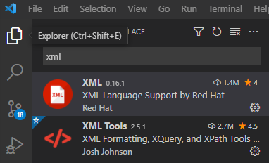
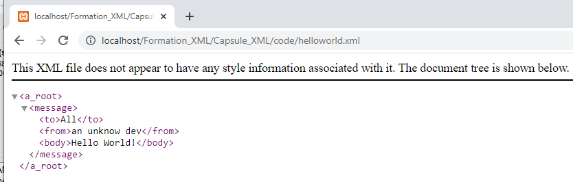

*<center>:loudspeaker: Bonjour à tous et à toutes :heavy_exclamation_mark:</center>*
-
---

 Dans cette  formation, on verra comment créer, valider (via *DTD* ou *Schéma*) , requêter (via *XPATH*) et transformer (via *XSLT et CSS*) des documents <mark>Extensible Markup Language   </mark> et on aura de nombreuses occasion de s'exercer et de produire des pages html très optimisées.

>  “ Extensible Markup Language (XML) is a simple, very flexible text format derived from SGML (ISO 8879). Originally designed to meet the challenges of large-scale electronic publishing, XML is also playing an increasingly important role in the exchange of a wide variety of data<i class="fas fa-database"></i> on the Web and elsewhere.”
>
> <cite> [<span style="line-height:70px"> -- W3C <i class="fas fa-external-link-alt"></i>](https://www.w3.org/XML/)</cite>
><hr/>


XML est un méta-language (un language qui permet de générer d'autre langage).  
Il est issu de SGML, pour résumer il est un peu comme HTML mais permet de faire beaucoup plus de choses, d'être plus précis, de définir nos balises par nous mêmes et on peut utiliser d'autres langages pour associer à nos documents XML du style ou les transformer selon nos besoins).

Il est l'un des formats d'échange de données <i class="fas fa-database"></i> les plus utilisés avec le format JSon.  
Il a fait ses preuves et est très couramment utilisé même si d'une façon générale on va utiliser des APIs afin de nous simplifier l'extraction et la transformation des datas qu'il contient.

Paramétrons notre environnement de développement (ça va être rapide :smile:) afin de pouvoir démarrer la formation : 
## TODO  :roller_coaster:: 
- `Télécharger` *PUIS* `installer` Xampp (peu importe la version) :[->ICI <i class="fas fa-external-link-alt"></i><-](https://www.apachefriends.org/fr/index.html).
- `Télécharger` *PUIS* `installer` l’éditeur Xml  [->ICI <i class="fas fa-external-link-alt"></i><- ](https://media4.obspm.fr/outils/mex/index.html).

- `Télécharger` *PUIS* `installer`  Visual Studio Code :[->ICI <i class="fas fa-external-link-alt"></i><- ](https://code.visualstudio.com/).
- Installer les 2 extensions XML (celle de Red Hat pour le linter intégré et celle de Josh Johnson pour le formatting et la validation des expressions XPath et autres) pour VSC : <kbd>CTRL + SHIFT + X</kbd> puis tapez XML, c'est simple ce sont les 2 les plus téléchargées (donc tout en haut).

- Il faudra peut-être redémarrer entre-temps VSC, faites lui plaisir, faites le s'il vous le demande.
- Ouvrez un répertoire de travail File -> Open Folder puis
  - On va dans le menu des fichiers en haut a gauche <kbd>CTRL + SHIFT + E</kbd> et 
  - Ensuite soit on clique sur le symbole situé en 1 soit on fait File -> New file, soit on fait <kbd>CTRL + N</kbd> pour  créer un nouveau fichier que l'on va enregistrer <kbd>CTRL + S</kbd> en tant que helloworld`.xml` 
  - Et ensuite on entre à l'intérieur le code suivant :
 ```xml
  <?xml version="1.0" encoding="UTF-8"?>
    <a_root>
        <message>
            <to>All</to>
            <from>an unknow dev</from>
            <body>Hello World!</body>
        </message>
    </a_root>
  ```
<div class="d-sm-block  alert alert-warning text-center" role="alert"> Si vous avez des erreurs dans le fichier ou que rien ne s'affiche quand vous essayez de le lire avec votre navigateur (FireFox (en direct) ou Chrome (via votre serveur web en local)) c'est probablement que se sont glissés des caractères non-conformes lors de la copie ou <kbd>CTRL+C CTRL+V</kbd>.<br/> Pour y pallier il faut supprimez et recréez les espaces(l'encodage du caractère peut poser problème)</div>

- Au besoin voilà le fichier <mark> helloworld.xml </mark> (qui est ok :tongue:) et que vous pouvez récupérer [->ICI <i class="fas fa-external-link-alt"></i><- ](helloworld.xml). 

- Volà le rendu une fois le document helloworld.xml chargé depuis votre navigateur (pour le style, le requêtage et les transformations on va voir tout ça avec la formation :mortar_board:) :


Crédit image de fond (et si vous souhaitez en voir plus) : https://mamchenkov.net/wordpress/2004/09/03/the-xml-family-of-specifications-the-big-picture/   

<div class="d-sm-block  alert alert-success  text-left" role="alert">

:mortar_board: [Afin de débuter la Formation sur XML ensemble, vous aurez besoin de suivre les instructions du :books:support suivant et/ou de récupérer les éléments de la <span style='display:FLEX;margin:0'> apsule : (Logins & Passswords :closed_lock_with_key: donnés par le formateur &nbsp; <i class="fas fa-chalkboard-teacher"></i> &nbsp;)&nbsp; <i class="fas fa-external-link-alt"></i>.</span>](http://franpan.free.fr/formation/_xml323 "lien vers le site contenant les fichiers de la formation")
</div>

Merci de garder pour vous les ressources que vous y trouverez et de ne pas les diffuser :smirk:  
Merci de m'avertir de toute erreur ou coquille qui m'auraient échapées :heart_eyes:

:copyright: :no_entry_sign: Do not distribute    :relieved: