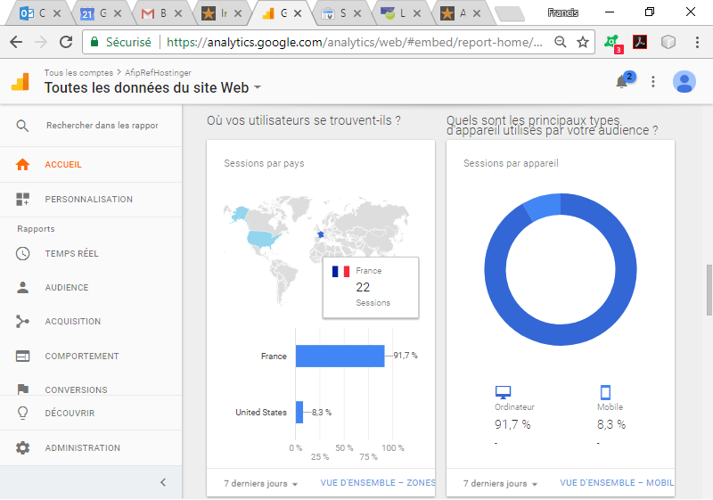
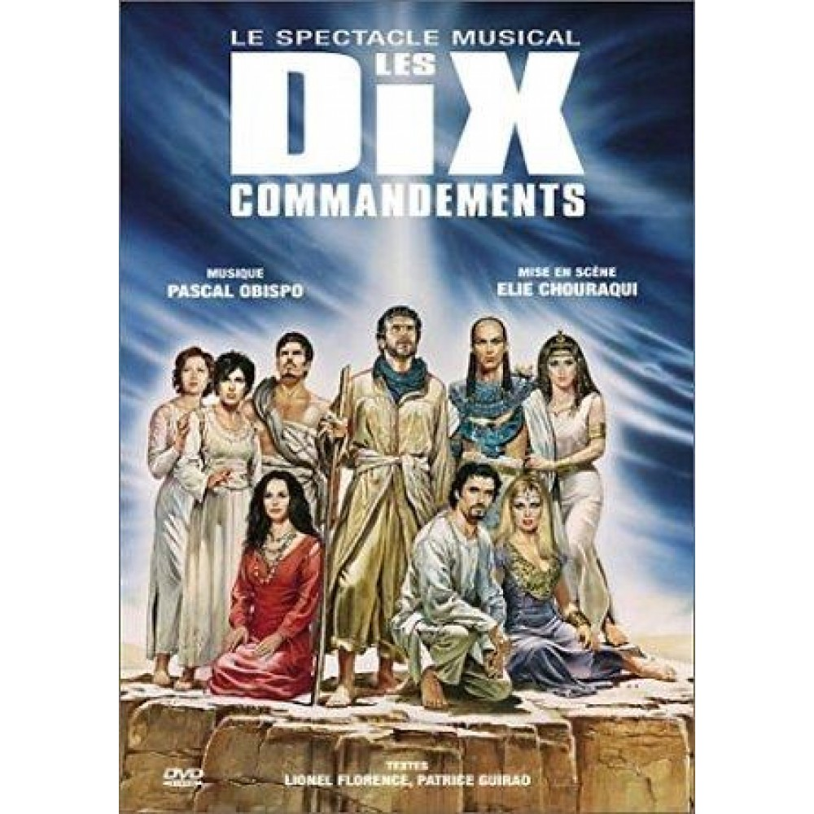
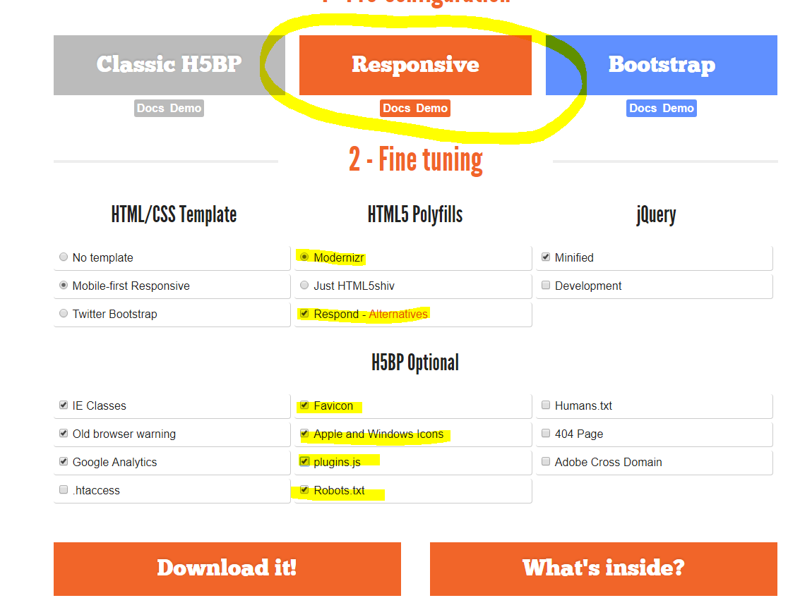

*
:loudspeaker: Bonjour à tous et à toutes :heavy_exclamation_mark:
*
-
---

>Le référencement est l'action de référencer, c'est-à-dire mentionner quelque chose ou y faire référence.  
 Sur Internet, le travail de référencement consiste à améliorer le positionnement et la visibilité de sites dans des pages de résultats de moteurs de recherche ou d'annuaires.  
Le référencement web s'articule autour de deux stratégies distinctes et complémentaires :  
:sunglasses: le référencement [naturel](#naturel)  (ou organique) <strong> SEO </strong>  
:moneybag: le référencement [payant](#payant) (ou liens sponsorisés).  
> - [Wikipédia](https://fr.wikipedia.org/wiki/R%C3%A9f%C3%A9rencement)

Avant de démarrer la formation on va lire les bases du référencement puis on prendra [10 conseils ](#10conseils)  , en enfin on suivra les [consignes](#consignes) afin de préparer la formation :fireworks:
<section>

### Les objectifs du référencement web
 
Il existe plusieurs objectifs au référencement web et à l'optimisation des moteurs de recherche&nbsp;:

          <ul>
            <li>Créer de la visibilité pour un site web sur les moteurs de recherche comme <a href="https://fr.wikipedia.org/wiki/Google_(moteur_de_recherche)" title="Google (moteur de recherche)">Google</a>, <a href="https://fr.wikipedia.org/wiki/Bing_(moteur_de_recherche)"
                title="Bing (moteur de recherche)">Bing</a> ou <a href="https://fr.wikipedia.org/wiki/Qwant" title="Qwant">Qwant</a>&nbsp;;</li>
            <li>Multiplier le nombre de visites de son site internet&nbsp;;</li>
            <li>Développer la popularité et la notoriété d’une personne physique ou d'une personne morale&nbsp;;</li>
            <li>Communiquer en ligne auprès d’une nouvelle cible d'internautes&nbsp;;</li>
            <li>Accroître le chiffre d’affaires web d’une entreprise au travers du <a href="https://fr.wikipedia.org/wiki/Commerce_%C3%A9lectronique" title="Commerce électronique">e-commerce</a> ou de la publicité en ligne.</li>
            <li>Nettoyer en cas de besoin la e-réputation d'une personne physique ou morale.</li>
          </ul>

###  Référencement naturel  

 
Faire un lien d'une page A vers une ressource B, c'est y faire référence et donc référencer la ressource B depuis la page A. Par vulgarisation, l'action générique d'inscription dans les moteurs de recherche a été appelée référencement.  
 Aujourd'hui, sa pratique s'articule autour des outils de recherche, plus particulièrement des moteurs et des annuaires de recherche, en tentant d'améliorer le positionnement des sites (et donc leur visibilité) dans leurs pages de résultats, appelées SERP (search engine results pages) dans le jargon du référencement.  
 Il s'agit en l’occurrence de travailler les éléments internes et externes des sites pour permettre de donner plus facilement les informations à la fois aux internautes mais également aux moteurs de recherche. Cela se fait à travers la notoriété des sites, du contenu que les moteurs de recherches jugeront pertinent ou non et enfin de la structure du site (le code est-il compréhensible, léger, complet...).  
 On parle aujourd'hui de plus de 300 critères pour Google par exemple. Le positionnement sur les moteurs de recherche est une des principales sources de création de trafic sur un site web. En effet, il permet aux internautes d'accéder à un site sans connaître son adresse.  
 Les principaux moteurs de recherche sont capables de détecter les nouveaux documents sur le web (et les nouveaux sites). Un bon référencement sur le Web est essentiel puisque « 34 % des internautes cliquent sur le premier lien naturel d'une page de résultats ».  
 Avant l'apparition des moteurs de recherche, il était aussi indispensable d'être référencé dans des annuaires web.  
 Il peut aussi être intéressant d'être référencé sur des sites externes, notamment des sites de bookmarks (marque-pages) ou des pages de liens favoris ou encore sur des blogs, soit via un article, soit en utilisant la méthode dite d'échanges de liens.

### Référencement local

Le référencement local est le fait d'optimiser un site internet pour que ses pages soient positionnées lors d'une recherche incluant une localité, un code postal, ou faite par un internaute autorisant sa géo-localisation. Cette partie du référencement
prend de plus en plus d'importance ces dernières années et est de plus en plus prises en compte par Google, notamment pour la navigation mobile.   
Anciennement il suffisait d'inscrire un site dans des annuaires locaux comme les <a href="https://fr.wikipedia.org/wiki/Pages_jaunes"   title="Pages jaunes">Pages jaunes</a> ou <a href="https://fr.wikipedia.org/wiki/Google_Maps" title="Google Maps">Google Maps</a>.

### Référencement sur les annuaires  

<a href="https://fr.wikipedia.org/wiki/Annuaire_Web" title="Annuaire Web">annuaire Web</a> est un site classant de façon thématique les sites qu’il sélectionne lui-même ou qui lui sont soumis. Des éditeurs analysent alors le contenu des pages
et créent des résumés de leurs contenus dans le but d’orienter les visiteurs. Les annuaires proposent une recherche par catégories et sous-catégories. Il existe des milliers d’annuaires dits spécialisés ou généralistes (exemple : <a href="https://fr.wikipedia.org/wiki/Dmoz"   title="Dmoz">Dmoz</a> ou <a href="https://fr.wikipedia.org/wiki/Yahoo!" title="Yahoo!">Yahoo!</a> Directory). Les critères d’acceptation d’un site sur un annuaire dépendent de chaque annuaire. Cette pratique a été massivement utilisée par les référenceurs pour augmenter artificiellement leur <a href="https://fr.wikipedia.org/wiki/PageRank" title="PageRank">PageRank</a>. Cela dit, Google ayant commencé à pénaliser les annuaires web dès 2008, cette technique est de moins en moins utilisée, elle n'est d'ailleurs plus actualisée depuis 2013 et officiellement plus transmise par Google depuis 2016.

### Référencement payant 
Article détaillé&nbsp;: <a href="https://fr.wikipedia.org/wiki/Search_Engine_Advertising" title="Search Engine Advertising">Search Engine Advertising</a>.
Le référencement payant, en anglais <abbr class="abbr" title="Langue : anglais">en</abbr> Search Engine Advertising (SEA) consiste en la mise en place de liens sponsorisés dans les résultats de moteur de recherche, via une régie de publicité spécifique comme <a href="https://fr.wikipedia.org/wiki/Google_AdWords" class="mw-redirect" title="Google AdWords">Google AdWords</a> ou <a href="https://fr.wikipedia.org/wiki/Bing_(moteur_de_recherche)" title="Bing (moteur de recherche)">Bing Ads </a> par exemple.

### Référencement social
Article détaillé : <a href="https://fr.wikipedia.org/wiki/Social_Media_Optimization" title="Social Media Optimization">Social Media Optimization</a>.

La puissance des réseaux ouvre une nouvelle formule de référencement appelée référencement social (SMO).

 <a href="https://fr.wikipedia.org/wiki/R%C3%A9f%C3%A9rencement" title="Wikipédia Référencement">Source wikipédia</a>
 
</section>
  
  
---   
## 10 Conseils sur le référencement   
<section>
<figure style="float:left"> <figcaption>   :thought_balloon: :innocent: </figcaption></figure>

<strong>Voici les 10 commandement du bon référencement : 10 règles de base que vous devez absolument suivre si vous briguez les premières positions dans les moteurs de recherche. </strong>

Pour aider les <strong>créateurs de sites</strong> à mieux <strong>référencer </strong>leurs <strong>pages web</strong>, Google a édicté quelques <strong>règles </strong>explicitées dans ses documents. D&rsquo;autres sont vaguement <strong>évoquées </strong>et certaines sont <strong>déduites </strong>de manière empirique.  Voici <strong>10 règles de base</strong>, presque des <strong>commandements</strong>, que vous devez absolument connaître pour <strong>bien référencer</strong> les pages de votre
<strong>site Internet</strong>.

<h2 style="text-align: justify;  clear:both">1. Du bon contenu tu auras</h2>

Un<strong> bon référencement</strong> est d&rsquo;abord une affaire de <strong>bons contenus</strong>. Soyez clair dans ce que vous avez à dire, apportez <strong>de la valeur</strong> à vos visiteurs, <strong>ne dupliquez pas</strong> simplement
ce qui a été édité ailleurs.

Cela ne signifie pas que vous devez tout inventer (personne n&rsquo;invente tout, de toute façon) mais <strong>ne vous contentez pas de plagier</strong>. Comment faire du bon contenu ? Outre le fait de présenter de<strong> nouveaux points de vues</strong>,
de <strong>nouvelles idées</strong>, des <strong>techniques nouvelles</strong>, etc. Vous pouvez aussi <strong>traduire</strong>, <strong>transposer </strong>de l&rsquo;écrit à la <strong>vidéo</strong>, <strong>critiquer</strong>, regrouper,
classer et <strong>synthétiser </strong>des contenus existants, etc.

Vous avez sans doute noté que le commandement dit &laquo;&nbsp;<strong>tu auras</strong>&nbsp;&raquo; et non pas &laquo;&nbsp;<strong>tu créeras</strong>&laquo;&nbsp;. Vous n&rsquo;êtes <strong>pas obligé</strong> en tant qu&rsquo;éditeur <strong>de créer</strong>            votre contenu. Éditeurs, distributeurs, diffuseurs, etc montrent les créations d&rsquo;autrui. Vous aussi pouvez <strong>diffuser les créations des autres</strong>, tant que vous êtes dans la légalité bien sûr. Et comme le font les éditeurs,
vous avez <strong>le droit</strong> de <strong>modifier</strong> (avec l&rsquo;accord des auteurs) ce que l&rsquo;on vous propose avant de le publier.

<h2 style="text-align: justify;">2. Les bons mots tu choisiras</h2>

Avant de vous lancer dans la diffusion de contenus, qu&rsquo;il s&rsquo;agisse d&rsquo;images, de textes, de vidéos ou de documents audio, vous devez savoir <strong>de quoi</strong> vous allez <strong>parler </strong>et <strong>à qui</strong>            vous allez vous <strong>adresser</strong>. Une part non négligeable de votre public vient des moteurs de recherche (principalement de Google). Alors <a title="Google keyword Planner" href="https://ads.google.com/intl/fr_fr/home/tools/keyword-planner/" target="_blank"> choisissez les bons mot-clefs  </a>: ceux qui vous donneront plus de visibilité.

Comment choisir ses mot-clefs ? D&rsquo;abord en essayant de clarifier et de diversifier votre langage : Utilisez des <strong>synonymes</strong>, paraphrases, comparaisons, etc. Qualifiez ce que vous expliquez et ce que vous montrez en fonction
de ceux à qui vous parlez : quelle géographie ? Quelle âge ? Quelle passion ? Quel budget ? etc. Enfin utilisez (avec parcimonie) <a title="Keywords tool" href="https://adwords.google.com/select/KeywordToolExternal" target="_blank">l&rsquo;outils de recherche de mots clef de Google</a>.

<h2>3. Title, h1 et url tu harmoniseras</h2>

Ici on aborde un peu la technique :

<ul>
<li><strong>Le title</strong> (ou meta title) est le <strong>titre de votre page</strong>. Il apparait le plus souvent au dessus de votre fenêtre de navigation.</li>
<li>Si votre site est construit comme il faut, le <strong>H1</strong> est le titre principal de votre page. C&rsquo;est l&rsquo;équivalent presse de votre <strong>gros titre</strong>.</li>
<li>Et l&rsquo;url est <strong>l&rsquo;adresse web</strong> de votre page.</li>
</ul>

Imaginez un journal avec sur chaque page le même gros titre. Et pire encore, un gros titre qui ne donne aucune info, mais reprend le nom du journal. Et bien cette incongruité arrive sur énormément de sites. Mal construits, ils présentent en
guise de H1 (quand ils en ont un) le nom du site.

Dans un <strong>site bien construit</strong> chaque page doit avoir son propre <strong>gros titre</strong>. Un gros titre qui correspond au contenu de la page, évidemment. Ensuite chaque <strong>titre de page</strong> (title) doit <strong>reprendre </strong>(parfois
partiellement) le <strong>gros titre</strong> (à la façon d&rsquo;un en-tête de livre qui reprend le chapitre) et <strong>l&rsquo;url</strong> doit comporter<strong> l&rsquo;essentiel des mot- clefs</strong> du gros titre.

Comment harmoniser h1, title et url ? Avec l&rsquo;utilisation des <strong>variables </strong>en <strong>php</strong> (du code) et à la <strong>réécriture d&rsquo;url</strong> ou si vous utilisez <strong>WordPress </strong>grâce à un <strong>plugin </strong>comme
<a title="Page WordPress du plugin All in one SEO pack" href="http://wordpress.org/extend/plugins/all-in-one-seo-pack/" target="_blank">All in one SEO pack</a> et la <strong>configuration </strong>des urls canoniques.

<h2 style="text-align: justify;">4. Comme un journaliste tu présenteras</h2>

Il ne <strong>s&rsquo;agi</strong>t pas ici d&rsquo;écrire ou de filmer comme un journaliste car je ne parle pas du contenu mais de la <strong>forme</strong>. Il n&rsquo;est pas question non plus de vous obliger à avoir une présentation digne
des meilleurs magazines. Il s&rsquo;agit de rendre son <strong>contenu lisible</strong> ! Un texte <strong>facilement lisible</strong>, vous en avez conscience, doit aller au-delà du déchiffrable. Cela passe d&rsquo;abord par une <strong>bonne présentation</strong>.
Par une <strong>hiérarchisation </strong>de l&rsquo;information.

Imaginez une vidéo avec des coupures de phrases, des images qui apparaissent d&rsquo;un coup sans lien avec le discours, des explications sur différents sujets sans introduction ni même de distinction entre chaque thème&#8230; Bref, si vous
faites de <strong>l&rsquo;art</strong> avec vos informations, il faut que ce soit <strong>choisi</strong>.

<strong>Un texte</strong> (une vidéo, une bande son) <strong>bien présenté</strong> ne sera pas forcément lu (cela dépend du sujet) mais au moins vos visiteurs pourront <strong>scanner </strong>votre contenu pour <strong>évaluer </strong>ce
sujet et choisir de vous lire ou non.

Comment<strong> bien présenter</strong> un contenu ? <a title="Structure type d’un article de blog" href="http://www.pour-le-web.com/e-marketing/structure-type-dun-article-de-blog">Pour qu&rsquo;un texte soit scanné</a> donnez-lui <strong>un titre</strong>            principal qui <strong>résume </strong>votre article, un <strong>chapeau </strong>(terme journalistique qui décrit le texte en gras au dessus des articles) pour présenter le contenu. Des <strong>inter-titres</strong>, <strong>sous-titres</strong>            ou les deux pour <strong>hiérarchiser </strong>et <strong>structurer</strong>, etc. N&rsquo;hésitez pas à vous inspirer des mises en forme d&rsquo;un journal papier ou d&rsquo;un <strong>magazine</strong>. Prenez aussi en compte le fait qu&rsquo;Internet
est <strong>multi-média</strong>. Textes, images fixes et films ne sont pas incompatibles.

<h2>5. Des images parlantes tu utiliseras</h2>
<a href="http://www.gifsanimes.fr/animaux/">Une photo qui parle</a>   

Oui bon ok, c'est peut être pas a prendre au premier degré non plus :tongue:

Vos <strong>images </strong>justement, les <strong>photos </strong>en particulier, ne doivent <strong>pas rester isolées</strong>. La première chose à faire lorsque vous insérez une <strong>image </strong>dans un <strong>article </strong>c&rsquo;est
de savoir <strong>pourquoi</strong>. Mettre une image dans un article juste pour &laquo;&nbsp;faire joli&nbsp;&raquo; ne sert à rien et va déranger le lecteur.

Puisque <strong>vous savez pourquoi</strong> vous avez choisi telle ou telle image, si vous pensez que le lecteur risque de ne pas comprendre, <strong>expliquez le</strong> lui grâce à la légende. Dans le cas où l&rsquo;image est suffisamment
parlante alors <strong>précisez-</strong>en la nature. Une image de Rodin pourrait par exemple, sur un site d&rsquo;experts de la sculpture, préciser la date de création de l&rsquo;image : &laquo;&nbsp;<em>Rodin en 1908</em>&nbsp;&raquo; au
lieu de &laquo;&nbsp;<em>Rodin, sculpteur célèbre</em>&laquo;&nbsp;.

La <strong>balise alt</strong> est aussi très importante lorsque vous travaillez avec des <strong>photos</strong>. Pensez à la <strong>renseigner</strong>, car les moteurs de recherche sont aveugles, et lisent cette balise pour comprendre votre
image.

En ce qui concerne les <strong>films </strong>on doit <strong>comprendre </strong>ce qu&rsquo;il y aura dedans <strong>avant le visionnage</strong>. le plus logique est de leur donner un titre et de les résumer, même si c&rsquo;est d&rsquo;une
simple phrase. Bien sûr un petit article avec un point de vue (une critique par exemple) est encore mieux. Pour ce qui est des moteurs, vous pouvez au minimum renseigner les <strong>titres </strong>et <strong>description </strong>de vos vidéos.
<strong>Youtube </strong>donne aussi la possibilité d&rsquo;ajouter des <strong>sous-titres</strong> ou <strong>annotations</strong>. Cela peut servir à référencer la vidéo elle-même.

Enfin, pour les documents <strong>audio</strong>, pensez à proposer systématiquement une <strong>version textuelle</strong> de votre contenu, ou dans le cas d&rsquo;une musique une petite description ou critique.

<h2 style="text-align: justify;">6. Des liens explicites tu rédigeras</h2>

La question des <strong>liens </strong>est encore un aspect un peu <strong>technique</strong>, mais rien de compliqué à comprendre. Pour découvrir et comprendre vos pages, les <strong>robots </strong>d&rsquo;indexation passent <strong>à travers les liens</strong>            du web. En faisant cela ils lisent le texte par lequel ils ont voyagé et <strong>qualifient </strong>la page de <strong>destination</strong>.

Exactement <strong>comme un humain</strong> qui cliquerait sur un lien &laquo;&nbsp;Les secrets du référencement&nbsp;&raquo;. En faisant cela il s&rsquo;attend à trouver ces fameux secrets. S&rsquo;il les trouve il aura un <strong>avis </strong>positif
sur ce <strong>lien </strong>et à sa destination et s&rsquo;il ne trouve pas un contenu correspondant il se sentira floué.

En écrivant des<strong> liens explicites</strong> vous donnez donc de la <strong>matière </strong>aux <strong>robots</strong>, c&rsquo;est pourquoi vous devez éviter autant que possible les liens du genre &laquo;&nbsp;Cliquez ici&nbsp;&raquo;
ou &laquo;&nbsp;Lire la suite&nbsp;&raquo; . Bien sûr évitez aussi les liens sous forme d&rsquo;urls quand cela est possible.

<h2>7. :busts_in_silhouette: Sur les réseaux sociaux tu seras :eyes: </h2>
<i class="fab fa-facebook-square"></i><i class="fab fa-twitter-square"></i><i class="fab fa-instagram"></i>

C&rsquo;était déjà le cas avant <strong>2010</strong>, mais cette année-là ce fut rendu publique : <a title="FACEBOOK ET GOOGLE les géants du ref" href="https://www.amnesty.fr/actualites/facebook-et-google-les-geants-de-la-surveillance">les réseaux sociaux influencent votre référencement</a>. 
:scream_cat: Oups ce n'était pas le bon lien, le voici : <a title="Référencement naturel Influence réseaux sociaux" href="https://www.webrankinfo.com/dossiers/reseaux-sociaux/impact-referencement">Référencement naturel : Google et Bing disent utiliser Facebook et Twitter dans leur algorithme </a> :sweat_smile:  

Google et les autres <strong>moteurs de recherches</strong> prennent en <strong>compte </strong>les références à vos pages sur les <strong>réseaux sociaux</strong> pour leur <strong>référencement</strong>. En gros, plus vous avez de liens,
d&rsquo;annotations, de like, de retweet, bref de références sur les réseaux, plus votre page sera considérée comme importante.

Un autre aspect de ce <strong>référencement </strong>est influencé par <strong>ce qu&rsquo;aime</strong> (au sens propre, pas au sens de facebook) votre cercle social virtuel. Ainsi, si vos <strong>amis </strong>facebook vous recommandent une
page web sur la pêche, elle aura plus de chance d&rsquo;apparaitre dans les moteurs si vous cherchez des infos sur la pêche, même si une autre page est (dans l&rsquo;absolu) mieux classée.

Or à ce jour les deux réseaux sociaux les plus puissants sont <strong>Facebook, Google+ </strong>et <strong>Twitter</strong>. Et même si en soi un lien est un lien, d&rsquo;où qu&rsquo;il vienne, en vous concentrant sur ces trois plate-forme
vous gagnerez plus qu&rsquo;en visant tous les réseaux sociaux à la fois.

Ok, mais comment <a title="comment avoir plus de fans sur facebook" href="https://www.ludosln.net/comment-avoir-plus-de-fans-sur-facebook-10-astuces-qui-ont-fait-leurs-preuves/">gagner des fans sur Facebook</a>, des <a title="Comment augmenter votre nombre de followers sur Twitter" href="https://www.ionos.fr/digitalguide/web-marketing/les-media-sociaux/comment-augmenter-votre-nombre-de-followers-sur-twitter/">followers sur Twitter</a> et des membres dans vos cercles ? D&rsquo;abord en proposant aux <strong>visiteurs </strong>de votre site de <strong>vous rejoindre</strong>            sur ces plates-formes. Ensuite vous pouvez faire de la <strong>communication </strong>autour de vos communautés, offrir quelque chose à vos fans, cercles ou followers, mettre en place des jeux concours ou encore des partenariats.

<h2>8. Les autres blogs tu commenteras</h2>
:speech_balloon: :exclamation: :question: :thumbsup: :-1: :clap: :heart:  :fu: (ha non pas celui là, soyez gentil :angel:)

<strong>Commenter </strong>des blogs vous permet de créer des <strong>backlinks </strong>(des liens vers chez vous) et dans cet objectif il ne faut pas négliger les forums, digg-like et annuaires. Mais écrire sur le blog d&rsquo;un autre, même
un simple <strong>commentaire</strong>, n&rsquo;est <strong>pas </strong>un acte <strong>neutre</strong>.

Commenter un article de blog peut et devrait aussi servir à initier des relations avec le propriétaire du blog. :couplekiss: Avec un peu plus d&rsquo;effort de votre part pour écrire un commentaire valable, vous pourrez attirer son attention. :crying_cat_face: Et même si
ce dernier ne vous remarque pas, ses lecteurs, eux, peut être vous verront-ils.:eyes:

Pour ce qui est de <strong>digg-like</strong>, ce sont de vrai mines en terme de <strong>backlinks</strong>, car la plupart sont en dofollow (des liens suivis par les moteurs). Si vous arrivez dans leurs <strong>premières pages</strong> vous
bénéficierez d&rsquo;une soudaine <strong>visibilité </strong>qui vous apportera beaucoup de visiteurs. Alors essayez d&rsquo;écrire des résumés de vos articles et des titres qui donnent envie de <strong>voter pour vous</strong>.

Enfin, je vous recommande de ne pas trop compter sur les <strong>forums </strong>pour les liens. Car le travail que demande une vrai présence sur un forum vaut largement plus qu&rsquo;un lien. Si vous décidez d&rsquo;aller sur un forum, faites-le
pour une bonne raison : <strong>y participer et échanger</strong>.

Quel blog commenter ? Comment choisir ? Quel type de commentaires faut-il laisser ? Évidemment choisissez un <strong>blog </strong>dans votre <strong>thématique </strong>et autorisant les commentaires. Mais vérifiez aussi que ces derniers sont
en <strong>Dofollow</strong>, affichés dans la même page que l&rsquo;article et que vous pourrez laisser <strong>votre url</strong> de site. Pour le contenu, essayez de rédiger des avis ou d&rsquo;apporter une plus-value à l&rsquo;article.

<h2>9. De bons partenariats tu développeras</h2>

Pourquoi parler de <strong>partenariats </strong>et <strong>pas d&rsquo;échanges de liens</strong> ? Parce qu&rsquo;il ne s&rsquo;agit pas ici de simplement mettre une page &laquo;&nbsp;partenaires&nbsp;&raquo; dans laquelle on listerait une
pléthore de structures pouvant potentiellement faire la même chose pour nous. Ce serait perdre votre temps. D&rsquo;abord parce que <strong>plus il y a de lien</strong> sur une page, plus la <strong>valeur </strong>de ses liens <strong>diminuent</strong>.
Ensuite parce qu&rsquo;aujourd&rsquo;hui <strong>créer des backlinks</strong> est <strong>facile </strong>(avec les réseaux sociaux, le développement des blogs, des commentaires et des digg like).

En fait le seul intérêt de ce type de pages (je m&rsquo;écarte un peu du sujet) c&rsquo;est d&rsquo;essayer de voler des visiteurs à des sites qui serait mal répertoriés sur le net en utilisant leurs noms. Rien à voir donc avec un bon partenariat.

Alors ? Un bon partenariat c&rsquo;est quoi ? Un <strong>bon partenariat</strong> c&rsquo;est d&rsquo;abord un <strong>échange </strong>où les <strong>deux </strong>protagonistes sont <strong>gagnants</strong>. Un bon partenariat, c&rsquo;est
aussi <strong>un échange</strong> qui va au <strong>delà du ponctuel</strong>. C&rsquo;est une collaboration sur la durée avec des structures <strong>associées</strong>. Il ne mène pas nécessairement vers un projet de grande envergure, mais
il doit au moins pouvoir se reproduire de temps à autre.

Les <strong>articles invités</strong>, par exemple, sont de bons partenariats. C&rsquo;est du contenu et des visites pour l&rsquo;un, de la notoriété et des visites pour l&rsquo;autre. <strong>Les interviews</strong> (ou tout article sur un
partenaire) fonctionnent sur le même principe si les deux partenaires jouent le jeu : Les deux partis gagnent en crédibilité, le premier gagne des visiteur et le second de la notoriété. Les articles <strong>sponsorisés </strong>s&rsquo;en
approchent.

Au delà de <strong>partenariats </strong>sur le contenu il peut bien sûr y avoir des partenariats sur les <strong>actions </strong>: jeux <strong>concours </strong>sponsorisés, organisation <strong>d&rsquo;évènements</strong> communs, affiliation,
&#8230;Comme vous le voyez les partenariats ne servent pas uniquement le référencement.

<h2 style="text-align: justify;">10. Du :no_entry: flash et du javascript tu te méfieras</h2>

La réalité de cette assertion c&rsquo;est qu&rsquo;il faut <strong>éviter le flash comme la peste</strong>. Les <strong>robots </strong>sont <strong>incapables </strong>(à quelques exception près) <strong>de lire</strong> le contenu d&rsquo;un
<strong>flash</strong>. Pour eux, tout élément en <strong>flash est comme un carré noir</strong> auquel vous auriez donné un titre. Et comme Google est méfiant, il classera toujours les carrés noirs avec des titres en dessous des contenus
totalement lisibles sur le même sujet. Pour en rajouter, <strong>google </strong>ne sait <strong>pas suivre</strong> les <strong>liens en flash</strong>. Il ne pourra donc pas naviguer dans un site totalement en flash. Enfin, et ce n&rsquo;est
pas le moindre mal du flash : <strong>Apple </strong>et <strong>Adobe </strong>se livrent une petite <strong>bataille</strong> et la technologie <strong>flash </strong>ne peut <strong>pas </strong>être utilisée sur les <strong>iPhone </strong>ou
les iPad.

Donc, à moins d&rsquo;avoir vraiment besoin de flash, évitez-le dans vos sites. Flash is dead :end:, pas le héros hein, la technologie n'est plus développée par Adobe et le support a été retiré de la plupart des navigateurs, hormis les antiques :moyai:   

Le <strong>cas </strong>du <strong>javascript </strong>est un peu <strong>différent</strong> et beaucoup plus simple : les robots d&rsquo;indexation ne sont pas conçus pour le lire, même si certains (avec un rôle de vérification) savent le faire.
Donc quand vous utilisez du javascript <strong>veillez </strong>à développer une <strong>solution alternative</strong>. Par exemple, en laissant vos sous-menus ouverts par défaut et en les refermant grâce au javascript avant de les animer.

</section>
 

---  
## Bon l'intro est passée, passons aux choses sérieuses    
---

:mortar_board: Afin de poursuivre ce qu'on a démarré et de suivre la formation en rérérencement ensemble, vous aurez besoin de suivre les instructions du support suivant ::books:[_Login/Passsword:closed_lock_with_key:_](http://franpan.free.fr/formation/_referencement111) donné par le formateur :pill:.

TODO :roller_coaster::  
  - [x] Pré-Lecture du support donné par Google [->ICI<-](http://www.google.fr/webmasters/docs/search-engine-optimization-starter-guide-fr.pdf) _(on y reviendra dessus mais une lecture avant vous aidera à mieux comprendre assimiler et aller plus vite)_
  - [x] Création du compte pour votre site internet en ligne ici :  
    - Soit chez nos amis GitHub https://pages.github.com/
    - Soit chez nos amis Freenautes (plus long mais y a du php ) https://subscribe.free.fr/accesgratuit/
    - Ou les 2 si vous êtes gourmand et que vous avez du temps, un peu comme moi ...
  - [x] Création de votre site internet personnel via 
    - Un framework web rapide : http://www.initializr.com/
    - Suivez les indications de la photo ci-dessous pour télécharger un site web responsive déjà tout fait 	:heartpulse:
    
    - Du copié collé de référence Internationale ;) https://www.w3schools.com/css/css_rwd_templates.asp 
    - ou via site perso (oui oui ça arrive) 
  - [x] Téléchargement et installation du logiciel Winscp pour Windows sur votre ordinateur ici : https://sourceforge.net/projects/winscp/  
  Pour Mac utilisez votre logiciel ftp favori ;).
  - [ ] On fera un petit tour des sites produits par tout le monde, ça sera plus sympa et cela nous permettra d'échanger sur les différentes façons de créer un site vitrine. 
  Des idées ici : https://www.lafabriquedunet.fr/creation-site-vitrine/articles/12-exemples-sites-vitrines-reussis/. 

_
**Vous retrouverez toutes les instructions** [->ICI<-](TP1preparatoire.pdf "A ne pas diffuser :P")
_
 

## Débuter la formation <i class="fas fa-sitemap"></i>: 

:mortar_board: [Afin de débuter la Formation en <i class="fas fa-sitemap"></i> référencement ensemble, vous aurez besoin de suivre les instructions du  :books:support suivant et/ou de récupérer les éléments de la apsule : (Logins  & Passswords :closed_lock_with_key: donnés par le formateur <i class="fas fa-chalkboard-teacher"></i> ) <i class="fas fa-external-link-alt"></i>.](http://franpan.free.fr/formation/_referencement111 "lien vers le site contenant les fichiers de la formation")

Merci de garder pour vous les ressources que vous y trouverez et de ne pas les diffuser :smirk:  
Merci de m'avertir de toute erreur ou coquille qui m'auraient échapées :heart_eyes:

:copyright: :no_entry_sign: Do not distribute    :relieved: