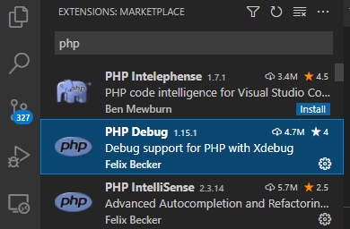
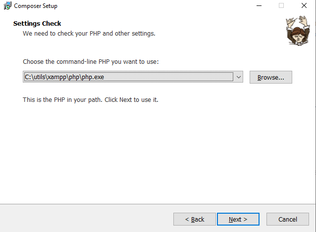
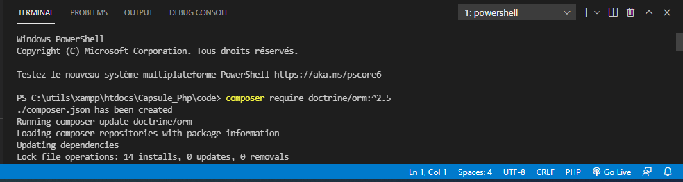
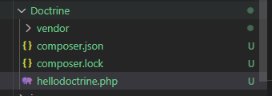
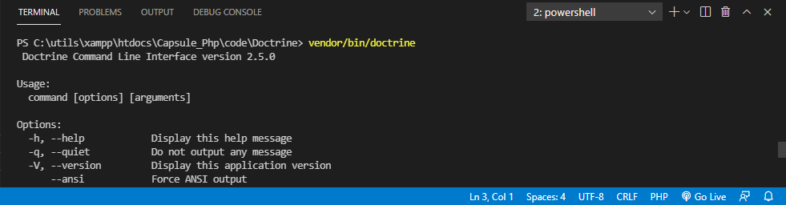
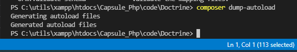

*<center>:loudspeaker: Bonjour à tous et à toutes :heavy_exclamation_mark:</center>*
-
---
<div class="d-sm-block  alert alert-primary" role="alert"> 
 Une fois n'est pas coutume, on va apprendre la technologie du cours via un <mark>Travail Dirigé </mark>en suivant l'excellent tuto suivant :<br/>  

https://zestedesavoir.com/tutoriels/1713/doctrine-2-a-lassaut-de-lorm-phare-de-php/les-bases-de-doctrine-2/<i class="fas fa-external-link-alt"></i>

</div>

Pourquoi ce choix ? :
- Pour vous faire travailler sur d'autres ressources que les miennes et découvrir que le web fourmille d'excellentes ressources (mais y a du buggé ou de l'outdated aussi, malheureusement )
- Parce qu'il est très bien fait et qu'il nous servira de base pour Doctrine 2.0
- Parce que la v3 de doctrine est dans les tuyaux et j'avoue avoir la flemme de faire un cours complet sur doctrine 2 pour après le mettre à jour avec la V3 :tongue:
- Parceque un bon développeur sait s'économiser et être écolo en pratiquant la <i class="fas fa-recycle" style="color:green"></i> réutilisation de code (oui oui, ce n'est pas de la fain....) :smile:


>  “ The Doctrine Project is the home to several PHP libraries primarily focused on database storage and object mapping. The core projects are the Object Relational Mapper (ORM) and the Database Abstraction Layer (DBAL) it is built upon. <br/> Doctrine has been downloaded a total of 2,222,562,433 times!”
>
> -- <cite>[doctrine-project.org <i class="fas fa-external-link-alt"></i>](https://www.doctrine-project.org/projects/doctrine-orm/en/current/tutorials/getting-started.html)</cite>   <hr/>
>  “ Doctrine est un ORM (couche d'abstraction à la base de données) pour PHP. Il s'agit d'un logiciel libre sous licence GNU LGPL.<br/>
Doctrine est l'ORM par défaut du framework Symfony (depuis la version 1.3 de ce framework). Cependant son utilisation dans le cadre d'un projet développé avec Symfony est optionnelle.<br/> De plus, il peut être utilisé avec de nombreux autres frameworks tels que Zend Framework, CodeIgniter, FLOW3 ou encore Lithium.”
>
> <cite>[  Wikipedia <i class="fas fa-external-link-alt"></i>](https://fr.wikipedia.org/wiki/Doctrine_(ORM) "Définition à lire pour bien comprendre")</cite>
><hr/>

On va donc voir ensemble comment installer, configurer et utiliser les opérations de base de l’ORM Doctrine (qui est l'un si ce n'est le plus utilisé avec PhP) via la modélisation et la réalisation d'une application simple de gestion de sondages.

*[L'ORM <i class="fas fa-external-link-alt"></i>](https://fr.wikipedia.org/wiki/Mapping_objet-relationnel) se place en interface entre un programme applicatif , ici notre WEB APP en Php, et une base de données relationnelle (<i class="fas fa-database"></i> MySQL) pour simuler une base de données orientée objet. Ce programme définit des correspondances entre les schémas de la base de données et les classes du programme applicatif.  

En résumé dans notre code php on va donner des instructions à l'orm pour qu'il sauvegarde, crée, modifie, supprime nos objets ou leurs propriétés très facilement sans passer par nos bonnes vieilles requêtes mysqli ou PDO (depuis php5.1).*

Crée en 2066 il s'inspire d'un autre ORM très célèbre qui est hibernate pour la techno <i class="fab fa-2x fa-java"></i> Java.  
Il a aussi son langage de requête orienté objet, le Doctrine Query Langage (DQL).  
Il peut être utilisé à la place du langage SQL pour créer les requêtes d'accès et de manipulation des données de la base de données. Sa syntaxe s'inspire du Hibernate Query Langage, le langage de requête d'**Hibernate**, et du <i class="fab fa-2x fa-java"></i> Java Persistence Query Language, celui de JPA.  

Doctrine se compose de 2 grandes parties :

- Doctrine ORM (la liaison entre nos objets et notre BDD s'appuie sur DBAL)
- Doctrine DBAL (DataBase Abstraction Layer, Couche d'abstraction de base de données en français) qui s'appuie sur PDO (Php Data Object)


Paramétrons notre environnement de développement (ça va être simple ... :smile:) afin de pouvoir démarrer le TD :

## TODO  :roller_coaster::

- `Télécharger` *PUIS* `installer` Xampp (une version qui supporte php 7+) :[->ICI <i class="fas fa-external-link-alt"></i><-](https://www.apachefriends.org/fr/index.html).
  - On le mettra dans un dossier le plus proche de la racine
  - On installera a minima  Apache / <i class="fa-solid fa-database fa-2xl"></i> MySQL / <i class="fa-brands fa-php fa-xl" style="color: #0e63a4;"></i> / phpMyAdmin 


- `Télécharger` *PUIS* `installer`   Visual Studio Code :[->ICI <i class="fas fa-external-link-alt"></i><- ](https://code.visualstudio.com/).

- Installer les 2 extensions <i class="fab fa-php fa-2x" style="vertical-align:middle; color:blue"></i> de Felix Becker (Un grand merci à lui au passage, la première pour le debuggage, la seconde pour le linter ) pour VSC : <kbd>CTRL + SHIFT + X</kbd> puis tapez PHP, c'est simple ce sont les 2 et 3 ieme les plus téléchargées (donc tout en haut) &rarr;&rarr;&rarr;

- Il faudra peut-être redémarrer entre-temps VSC, faites lui plaisir, faites le s'il vous le demande.
- Ouvrez un répertoire de travail File -> Open Folder puis
  - On va dans le menu des fichiers en haut à gauche <kbd>CTRL + SHIFT + E</kbd> 
  - Ensuite soit on clique sur le symbole situé en (1) soit on fait File -> New file, soit on fait <kbd>CTRL + N</kbd> pour  créer un nouveau fichier que l'on va enregistrer <kbd>CTRL + S</kbd> en tant que <mark> hellodoctrine`.php` </mark>
  - Et ensuite on entre à l'intérieur le code suivant :
```php
<?php 
echo "hello doctrine";
phpinfo();
```
- Lancez-le dans votre navigateur via votre serveur local afin de vous assurez que vous êtes bien en php7+ (si ce n'est pas le cas, faites le nécessaire afin d'avoir votre serveur local en php v7+ de fonctionnel, cf cours précédents).
- Passons aux choses sérieuses, on va installer **Composer**[->ICI <i class="fas fa-external-link-alt"></i><- ](https://getcomposer.org/)
  - Cliquez sur download, pour ceux sur Windows, `Télécharger` *PUIS* `Installer` l'exécutable, pour les autres, suivez la doc officielle
  - Dans les settings, vérifier que le chemin est bien celui de l'interpréteur php que vous allez lancer (vous pouvez en avoir plusieurs, a vous de choisir).
    - Si vous ne voyez rien, faites browse et allez dans le dossier d'installation de votre xampp, dans le sous-dossier php :
    
    - Puis on fait Next en lisant bien ce qui est écrit et en réagissant au besoin.
    - Dans notre dossier ouvert sur Visual Studio Code on fait un <i class="fas fa-mouse"></i> clic `DROIT` sur notre fichier puis `open in integrated terminal` (ou alors vous ouvrez un powershell/CMD/Windows Terminal dans le dossier) puis vous tapez la commande :
```bash
        composer require doctrine/orm:^2.5
```

Ce qui nous donne :


<div class="d-sm-block  alert alert-warning text-center" >Si vous avez des messages en rouge, il vous <mark> faut fermer puis relancer Visual Studio Code </mark> car les variables d'environnement avec lesquelles VSC à été démarré ont changées depuis l'installation de Composer</div>


Composer va faire le boulot pour nous, tout télécharger et installer dans notre dossier de travail    &rarr;&rarr;&rarr;
- Passons à sa configuration (copiez-coller le code suivant dans un fichier bootstrap`.php`):

```php
<?php
require_once join(DIRECTORY_SEPARATOR, [__DIR__, 'vendor',
'autoload.php']);

use Doctrine\ORM\Tools\Setup;
 use Doctrine\ORM\EntityManager;

$entitiesPath = [
 join(DIRECTORY_SEPARATOR, [__DIR__, "src", "Entity"])
 ];

 $isDevMode = true;
 $proxyDir = null;
 $cache = null;
 $useSimpleAnnotationReader = false;
 
  // Connexion à la base de données
  $dbParams = [
  'driver' => 'pdo_mysql',
  'host' => 'localhost',
  'charset' => 'utf8',
  'user' => 'root',
  'password' => '',
  'dbname' => 'poll',
  ];
 
  $config = Setup::createAnnotationMetadataConfiguration(
  $entitiesPath,
  $isDevMode,
  $proxyDir,
  $cache,
  $useSimpleAnnotationReader
  );
  $entityManager = EntityManager::create($dbParams, $config);
  return $entityManager;
```

<div class="d-sm-block  alert alert-info border border-info " >La variable $dbParams désigne les paramètres de connexion que nous allons utiliser. Pour notre cas, nous aurons donc une base de données MySQL en local nommée <mark> poll</mark> avec comme utilisateur <mark>root sans mot de passe</mark>. À ce stade, seul le paramètre $dbParams nous intéresse. Nous aurons l’occasion d’aborder et d’expliciter l’utilité des autres paramètres par la suite.
</div>

- Puis créons un autre fichier pour finaliser la configuration de Doctrine (copiez-coller le code suivant dans un fichier cli-config`.php`):
```php
 <?php
 #### cli-config.php
$entityManager = require_once join(DIRECTORY_SEPARATOR, [__DIR__, 'bootstrap.php']);
use Doctrine\ORM\Tools\Console\ConsoleRunner;
return ConsoleRunner::createHelperSet($entityManager);
```

- On vérifie que tout est bon en tappant la commande suivante dans l'invite de commande <i class="fas fa-terminal"></i> :

```shell
vendor/bin/doctrine
```

PS : Quand tout est bon on a pas d'erreur à la fin et on peut taper nos <i class="fas fa-terminal " style="background-color:grey" > lignes de commandes </i>  pour Doctrine :smile:
  

- Pour finir on va configurer Composer pour qu'il gère l'autoloading, pour ce faire modifier le fichier config.json avec le code suivant :

```json
{
  "require": {
    "doctrine/orm": "2.5"
  },
  "autoload": {
    "psr-4": {
      "Tuto\\": "src/"
    }
  }
}
```



- On recharge la configuration de l'autoloader de Composer via la commande suivante :

```shell
composer dump-autoload
```  

<br/>

Maintenant que ***Doctrine*** est correctement installé et configuré, nous allons l’exploiter dans notre projet pour mettre en place un modèle de données full Orienté Objet
<hr/>

<div class="d-sm-block  alert alert-success  text-left" role="alert">


:mortar_board: [Afin de débuter la Formation sur Doctrine ensemble, vous aurez besoin de suivre les instructions du :books:support suivant et/ou de récupérer les éléments de la <span style='display:FLEX;margin:0'> apsule : (Logins & Passswords :closed_lock_with_key: donnés par le formateur &nbsp; <i class="fas fa-chalkboard-teacher"></i> &nbsp;)&nbsp; <i class="fas fa-external-link-alt"></i>.</span>](http://franpan.free.fr/formation/_doctrine327 "lien vers le site contenant les fichiers de la formation")

</div>

Merci de garder pour vous les ressources que vous y trouverez et de ne pas les diffuser :smirk:  
Merci de m'avertir de toute erreur ou coquille qui m'auraient échapées :heart_eyes:

:copyright: :no_entry_sign: Do not distribute    :relieved: